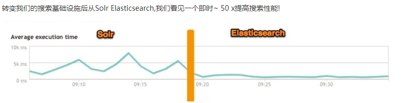
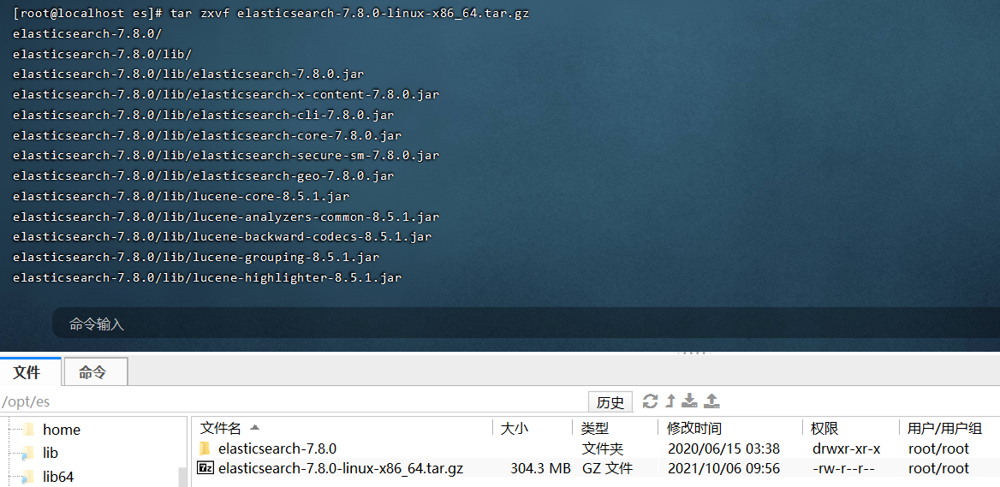
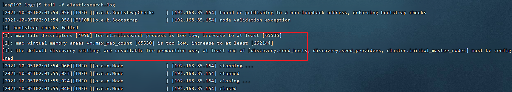

# Elastic Search Day01

## 课程内容

- elasticsearch 概述
- elasticsearch 安装
- elasticsearch 查询
- 客户端api使用

## 1. elasticsearch 概述

### 1.1 简介

官网: https://www.elastic.co/

Elasticsearch (简称ES)是一个分布式、RESTful 风格的搜索和数据分析引擎，能够解决不断涌现出的各种用例。

> 查询和分析
>
> - 可以自定义搜索方式: 通过 Elasticsearch，您能够执行及合并多种类型的搜索（结构化数据、非结构化数据、地理位置、指标），搜索方式随心而变。先从一个简单的问题出发，试试看能够从中发现些什么。
> - 分析大规模数据: 找到与查询最匹配的 10 个文档并不困难。但如果面对的是十亿行日志，又该如何解读呢？Elasticsearch 聚合让您能够从大处着眼，探索数据的趋势和规律。
>
> 查询速度
>
> - 近实时搜索(数据1s之内可见)
> - 通过有限状态转换器实现了用于全文检索的倒排索引，实现了用于存储数值数据和地理位置数据的 BKD 树，以及用于分析的列存储。
> - 每个数据都被编入了索引，因此您再也不用因为某些数据没有索引而烦心。您可以用快到令人惊叹的速度使用和访问您的所有数据。
>
> 可扩展性
>
> - 无论 Elasticsearch 是在一个节点上运行，还是在一个包含 300 个节点的集群上运行，您都能够以相同的方式与 Elasticsearch 进行通信。
> - 它能够水平扩展，每秒钟可处理海量事件，同时能够自动管理索引和查询在集群中的分布方式，以实现极其流畅的操作。
>
> 内容相关度
>
> - 基于各项元素（从词频或新近度到热门度等）对搜索结果进行排序。将这些内容与功能进行混搭，以优化向用户显示结果的方式。
>
>   而且，由于我们的大部分用户都是真实的人，Elasticsearch 具备齐全功能，可以处理包括各种复杂情况（例如拼写错误）在内的人为错误。
>
> 弹性设计
>
> - 硬件故障。网络分割。Elasticsearch 为您检测这些故障并确保您的集群（和数据）的安全性和可用性。通过跨集群复制功能，辅助集群可以作为热备份随时投入使用。Elasticsearch 运行在一个分布式的环境中，从设计之初就考虑到了这一点，目的只有一个，让您永远高枕无忧

创始人:Shay Banon（谢巴农）


**搜索引擎典型应用场景:**


### 1.2 全文搜索引擎

Google，百度类的网站搜索，它们都是根据网页中的关键字生成索引，我们在搜索的时候输入关键字，它们会将该关键字即索引匹配到的所有网页返回；还有常见的项目中应用日志的搜索等等。对于这些非结构化的数据文本，关系型数据库搜索不是能很好的支持。

一般传统数据库，全文检索都实现的很鸡肋，因为一般也没人用数据库存文本字段。进行全文检索需要扫描整个表，如果数据量大的话即使对SQL的语法优化，也收效甚微。建立了索引，但是维护起来也很麻烦，对于 insert 和 update 操作都会重新构建索引。

这里说到的全文搜索引擎指的是目前广泛应用的主流搜索引擎。它的工作原理是计算机索引程序通过扫描文章中的每一个词，对每一个词建立一个索引，指明该词在文章中出现的次数和位置，当用户查询时，检索程序就根据事先建立的索引进行查找，并将查找的结果反馈给用户的检索方式。这个过程类似于通过字典中的检索字表查字的过程。

### 1.3 lucene介绍

​	Lucene是Apache软件基金会Jakarta项目组的一个子项目，提供了一个简单却强大的应用程式接口，能够做全文索引和搜寻。在Java开发环境里Lucene是一个成熟的免费开源工具。就其本身而言，Lucene是当前以及最近几年最受欢迎的免费Java信息检索程序库。但Lucene只是一个提供全文搜索功能类库的核心工具包，而真正使用它还需要一个完善的服务框架搭建起来进行应用。

​	目前市面上流行的搜索引擎软件，主流的就两款：Elasticsearch和Solr,这两款都是基于Lucene搭建的，可以独立部署启动的搜索引擎服务软件。由于内核相同，所以两者除了服务器安装、部署、管理、集群以外，对于数据的操作 修改、添加、保存、查询等等都十分类似。

### 1.4 倒排索引


**倒排索引步骤:**

- 数据根据词条进行分词,同时记录文档索引位置
- 将词条相同的数据化进行合并
- 对词条进行排序

**搜索过程:**

先将搜索词语进行分词，分词后再倒排索引列表查询文档位置(docId)。根据docId查询文档数据。

### 1.5 elasticsearch、solr对比




**ElasticSearch vs Solr 总结**

- es基本是开箱即用，非常简单。Solr安装略微复杂。
- Solr 利用 Zookeeper 进行分布式管理，而 Elasticsearch 自身带有分布式协调管理功能。
- Solr 支持更多格式的数据，比如JSON、XML、CSV，而 Elasticsearch 仅支持json文件格式。
- Solr 是传统搜索应用的有力解决方案，但 Elasticsearch 更适用于新兴的实时搜索应用。

现在很多互联网应用都是要求实时搜索的，所以我们选择了elasticsearch。

## 2. elasticsearch 安装

### 2.1 下载软件

https://www.elastic.co/cn/downloads/past-releases#elasticsearch

**选择7.8版本即可，其它elastic stack也可以在这里下载。**

下载对应操作系统平台的版本:


### 2.2 windows环境安装

解压elasticsearch-7.8.0-windows-x86_64.zip，目录结构:


| 目录    | 说明           |
| ------- | -------------- |
| bin     | 可执行脚本目录 |
| config  | 配置目录       |
| jdk     | 内置jdk目录    |
| lib     | 类库           |
| logs    | 日志目录       |
| modules | 模块目录       |
| plugins | 插件目录       |

解压完成后进入bin目录，双击运行elasticsearch.bat


测试访问: http://localhost:9200/


### 2.3 linux环境安装

将下载好的elasticsearch-7.8.0-linux-x86_64.tar.gz上传至服务器并解压。先将jdk环境搭建好，jdk环境配置略。



#### 2.3.1 前提条件

elasticsearch不能直接通过root用户启动，所以要先创建一个普通用户。

```shell
#创建用户
useradd es;
#设置密码
passwd es;
```

**给普通用户授权**:

```shell
chown -R es /opt/es
```

**给用户设置sudo权限**:

```shell
#使用root用户执行
visudo
#在root    ALL=(ALL)       ALL下面新增
es      ALL=(ALL)       ALL
```


普通用户在启动elasticsearch时会出现下面错误:



解决办法:

**普通用户打开文件最大数限制修改**

```shell
#编辑limits.conf文件
vi /etc/security/limits.conf

#添加以下内容
* soft nofile 65536 
* hard nofile 131072 
* soft nproc 2048 
* hard nproc 4096
```

**普通用户启动线程数限制**

```shell
# Centos6 
vi /etc/security/limits.d/90‐nproc.conf
# Centos7
vi /etc/security/limits.d/20‐nproc.conf

#添加以下内容
* soft nproc 4096
```

**普通用户增大虚拟内存**

```shell
vi /etc/sysctl.conf
#添加以下内容:
vm.max_map_count=262144

#保存后执行sysctl -p让配置生效
sysctl -p
```

全部步骤完成后需要重新打开终端，重新登入。

#### 2.3.2 修改配置

切换普通用户(es)登入，进入到${解压目录}/config目录下，修改elasticsearch.yml配置文件:

```yaml
#集群名称
cluster.name: my-application
#节点名称
node.name: node-1
#数据文件目录
path.data: ./data
#日志文件目录
path.logs: ./logs
#运行访问的网络，0.0.0.0表示任意ip都匹配，这样可以远程访问
network.host: 0.0.0.0
#http rest服务端口
http.port: 9200
#集群初始master选举节点
cluster.initial_master_nodes: ["node-1"]
```

#### 2.3.3 启动elasticsearch

```shell
#进入到bin目录(注意，不能使用root账号启动)
./elasticsearch -d
```


浏览器测试访问:


### 2.4 docker安装

```shell
docker run -v /opt/elasticsearch:/data/elasticsearch -p 9200:9200 -p 9300:9300 -e "discovery.type=single-node" -d --name elasticsearch docker.elastic.co/elasticsearch/elasticsearch:7.8.0
```

### 2.5 kibana安装

elasticsearch服务是一个restful风格的http服务。我们可以采用postman作为客户端来进行操作，elastic stack官方也给我们提供了kibana来进行客户端操作，这个相比postman要友好一点，因为里面有些自动补全的代码提示。

下载地址: https://www.elastic.co/cn/downloads/past-releases/kibana-7-8-0


上传tar并解压文件:


进入到config目录，修改kibana.yml文件：

```yaml
#服务端口
server.port: 5601
#运行访问的IP设置，0.0.0.0可以远程访问
server.host: "0.0.0.0"
```

进入bin目录，后台启动kibana:

```shell
nohup ./kibana &
```


开始访问：http://192.168.6.100:5601/


### 2.6 ik分词器安装

下载地址: https://github.com/medcl/elasticsearch-analysis-ik/releases/download/v7.8.0/elasticsearch-analysis-ik-7.8.0.zip

进入到**${es安装目录}/plugins**目录，**新建ik目录**。


```shell
#在ik目录下解压elasticsearch-analysis-ik-7.8.0.zip文件
unzip elasticsearch-analysis-ik-7.8.0.zip
#删除zip文件
rm -f elasticsearch-analysis-ik-7.8.0.zip
```

重启es:


测试分词器:

```json
POST _analyze
{
  "analyzer": "ik_smart",
  "text": "我是中国人"
}
```


## 3. elasticsearch核心概念

### 3.1 es对照数据库


### 3.2 索引(Index)

一个索引就是一个拥有几分相似特征的文档的集合。比如说，你可以有一个客户数据的索引，另一个产品目录的索引，还有一个订单数据的索引。一个索引由一个名字来标识（必须全部是小写字母），并且当我们要对这个索引中的文档进行索引、搜索、更新和删除的时候，都要使用到这个名字。在一个集群中，可以定义任意多的索引。

能搜索的数据必须索引，这样的好处是可以提高查询速度，比如：新华字典前面的目录就是索引的意思，目录可以提高查询速度。

***Elasticsearch索引的精髓：一切设计都是为了提高搜索的性能。***

### 3.3 类型(Type)

在一个索引中，你可以定义一种或多种类型。

一个类型是你的索引的一个逻辑上的分类/分区，其语义完全由你来定。通常，会为具有一组共同字段的文档定义一个类型。不同的版本，类型发生了不同的变化

| 版本 | Type                                           |
| ---- | ---------------------------------------------- |
| 5.x  | 支持多种type                                   |
| 6.x  | 只能有一种type                                 |
| 7.x  | 默认不再支持自定义索引类型（默认类型为：_doc） |

### 3.4 文档(Document)

一个文档是一个可被索引的基础信息单元，也就是一条数据

比如：你可以拥有某一个客户的文档，某一个产品的一个文档，当然，也可以拥有某个订单的一个文档。文档以JSON（Javascript Object Notation）格式来表示，而JSON是一个到处存在的互联网数据交互格式。

在一个index/type里面，你可以存储任意多的文档。

### 3.5 字段(Field)

相当于是数据表的字段，对文档数据根据不同属性进行的分类标识。

### 3.6 映射(Mapping)

mapping是处理数据的方式和规则方面做一些限制，如：某个字段的数据类型、默认值、分析器、是否被索引等等。这些都是映射里面可以设置的，其它就是处理ES里面数据的一些使用规则设置也叫做映射，按着最优规则处理数据对性能提高很大，因此才需要建立映射，并且需要思考如何建立映射才能对性能更好。

## 4. elasticsearch基本操作

参考文档: https://www.elastic.co/guide/en/elasticsearch/reference/7.8/index.html


### 4.1 分词器

官方提供的分词器有这么几种: Standard、Letter、Lowercase、Whitespace、UAX URL Email、Classic、Thai等，中文分词器可以使用第三方的比如IK分词器。前面我们已经安装过了。

IK分词器核心配置:

- main.dic：单词词典
- stopword.dic: 停用词，这里只记录了英文的一部分单词，比如: a、an、and、are、as、at、be、but、by等。


IK分词器:

```json
POST _analyze
{
  "analyzer": "ik_smart",
  "text": "我是中国人"
}

结果:
{
  "tokens" : [
    {
      "token" : "我",
      "start_offset" : 0,
      "end_offset" : 1,
      "type" : "CN_CHAR",
      "position" : 0
    },
    {
      "token" : "是",
      "start_offset" : 1,
      "end_offset" : 2,
      "type" : "CN_CHAR",
      "position" : 1
    },
    {
      "token" : "中国人",
      "start_offset" : 2,
      "end_offset" : 5,
      "type" : "CN_WORD",
      "position" : 2
    }
  ]
}

POST _analyze
{
  "analyzer": "ik_max_word",
  "text": "我是中国人"
}
结果:
{
  "tokens" : [
    {
      "token" : "我",
      "start_offset" : 0,
      "end_offset" : 1,
      "type" : "CN_CHAR",
      "position" : 0
    },
    {
      "token" : "是",
      "start_offset" : 1,
      "end_offset" : 2,
      "type" : "CN_CHAR",
      "position" : 1
    },
    {
      "token" : "中国人",
      "start_offset" : 2,
      "end_offset" : 5,
      "type" : "CN_WORD",
      "position" : 2
    },
    {
      "token" : "中国",
      "start_offset" : 2,
      "end_offset" : 4,
      "type" : "CN_WORD",
      "position" : 3
    },
    {
      "token" : "国人",
      "start_offset" : 3,
      "end_offset" : 5,
      "type" : "CN_WORD",
      "position" : 4
    }
  ]
}

```

Standard分词器:

```json
POST _analyze
{
  "analyzer": "standard",
  "text": "我是中国人"
}

结果:
{
  "tokens" : [
    {
      "token" : "我",
      "start_offset" : 0,
      "end_offset" : 1,
      "type" : "<IDEOGRAPHIC>",
      "position" : 0
    },
    {
      "token" : "是",
      "start_offset" : 1,
      "end_offset" : 2,
      "type" : "<IDEOGRAPHIC>",
      "position" : 1
    },
    {
      "token" : "中",
      "start_offset" : 2,
      "end_offset" : 3,
      "type" : "<IDEOGRAPHIC>",
      "position" : 2
    },
    {
      "token" : "国",
      "start_offset" : 3,
      "end_offset" : 4,
      "type" : "<IDEOGRAPHIC>",
      "position" : 3
    },
    {
      "token" : "人",
      "start_offset" : 4,
      "end_offset" : 5,
      "type" : "<IDEOGRAPHIC>",
      "position" : 4
    }
  ]
}

```

### 4.2 索引操作

#### 4.2.1 创建索引

语法: PUT /{索引名称}

```json
PUT /my_index

结果:
{
  "acknowledged" : true,
  "shards_acknowledged" : true,
  "index" : "my_index"
}
```

#### 4.2.2 查看所有索引

语法: GET /_cat/indices?v


#### 4.2.3 查看单个索引

语法: GET /{索引名称}

```json
GET /my_index
结果:
{
  "my_index" : {
    "aliases" : { },
    "mappings" : { },
    "settings" : {
      "index" : {
        "creation_date" : "1633499968211",
        "number_of_shards" : "1",
        "number_of_replicas" : "1",
        "uuid" : "bclHUdHrS4W80qxnj3NP0A",
        "version" : {
          "created" : "7080099"
        },
        "provided_name" : "my_index"
      }
    }
  }
}
```

#### 4.2.4 删除索引

语法: DELETE /{索引名称}

```json
DELETE /my_index
结果:
{
  "acknowledged" : true
}
```

### 4.3 文档操作

#### 4.3.1 创建文档

语法:

PUT /{索引名称}/{类型}/{id}

{

jsonbody

}

```shell
PUT /my_index/_doc/1
{
  "title": "小米手机",
  "category": "小米",
  "images": "http://www.gulixueyuan.com/xm.jpg",
  "price": 3999
}

返回结果:
{
  "_index" : "my_index",
  "_type" : "_doc",
  "_id" : "1",
  "_version" : 1,
  "result" : "created",
  "_shards" : {
    "total" : 2,
    "successful" : 1,
    "failed" : 0
  },
  "_seq_no" : 0,
  "_primary_term" : 1
}
```

#### 4.3.2 查看文档

语法:GET /{索引名称}/{类型}/{id}

```shell
GET /my_index/_doc/1
结果:
{
  "_index" : "my_index",
  "_type" : "_doc",
  "_id" : "1",
  "_version" : 1,
  "_seq_no" : 0,
  "_primary_term" : 1,
  "found" : true,
  "_source" : {
    "title" : "小米手机",
    "category" : "小米",
    "images" : "http://www.gulixueyuan.com/xm.jpg",
    "price" : 3999
  }
}
```

#### 4.3.3 修改文档

语法: 

PUT /{索引名称}/{类型}/{id}

{

jsonbody

}

```shell
PUT /my_index/_doc/1
{
  "title": "小米手机",
  "category": "小米",
  "images": "http://www.gulixueyuan.com/xm.jpg",
  "price": 4500
}
```

#### 4.3.4 修改局部属性

语法: 

POST /{索引名称}/_update/{docId}
{
  "doc": {
    "属性": "值"
  }
}

**注意：这种更新只能使用post方式。**

```shell
POST /my_index/_update/1
{
  "doc": {
    "price": 4500
  }
}
```

#### 4.3.5 删除文档

语法: DELETE /{索引名称}/{类型}/{id}

```shell
DELETE /my_index/_doc/1
结果:
{
  "_index" : "my_index",
  "_type" : "_doc",
  "_id" : "1",
  "_version" : 12,
  "result" : "deleted",
  "_shards" : {
    "total" : 2,
    "successful" : 1,
    "failed" : 0
  },
  "_seq_no" : 11,
  "_primary_term" : 1
}
```

#### 4.3.6 批量操作

{"actionName":{"_index":"indexName", "_type":"typeName","_id":"id"}} 

 {"field1":"value1", "field2":"value2"} 

actionName可以有CREATE、DELETE等。

##### 批量创建

```shell
POST _bulk
{"create":{"_index":"my_index","_id":2}}
{"id":2,"title":"华为手机","category":"华为","images":"http://www.gulixueyuan.com/xm.jpg","price":5500}
{"create":{"_index":"my_index","_id":3}}
{"id":3,"title":"VIVO手机","category":"vivo","images":"http://www.gulixueyuan.com/xm.jpg","price":3600}

结果:
{
  "took" : 2,
  "errors" : false,
  "items" : [
    {
      "create" : {
        "_index" : "my_index",
        "_type" : "_doc",
        "_id" : "2",
        "_version" : 5,
        "result" : "created",
        "_shards" : {
          "total" : 2,
          "successful" : 1,
          "failed" : 0
        },
        "_seq_no" : 20,
        "_primary_term" : 1,
        "status" : 201
      }
    },
    {
      "create" : {
        "_index" : "my_index",
        "_type" : "_doc",
        "_id" : "3",
        "_version" : 5,
        "result" : "created",
        "_shards" : {
          "total" : 2,
          "successful" : 1,
          "failed" : 0
        },
        "_seq_no" : 21,
        "_primary_term" : 1,
        "status" : 201
      }
    }
  ]
}

```

##### 批量删除

```shell
POST _bulk
{"delete":{"_index":"my_index","_id":2}}
{"delete":{"_index":"my_index","_id":3}}

结果:
{
  "took" : 3,
  "errors" : false,
  "items" : [
    {
      "delete" : {
        "_index" : "my_index",
        "_type" : "_doc",
        "_id" : "2",
        "_version" : 6,
        "result" : "deleted",
        "_shards" : {
          "total" : 2,
          "successful" : 1,
          "failed" : 0
        },
        "_seq_no" : 22,
        "_primary_term" : 1,
        "status" : 200
      }
    },
    {
      "delete" : {
        "_index" : "my_index",
        "_type" : "_doc",
        "_id" : "3",
        "_version" : 6,
        "result" : "deleted",
        "_shards" : {
          "total" : 2,
          "successful" : 1,
          "failed" : 0
        },
        "_seq_no" : 23,
        "_primary_term" : 1,
        "status" : 200
      }
    }
  ]
}
```

### 4.4 映射mapping

有了索引库，等于有了数据库中的database。

接下来就需要建索引库(index)中的映射了，类似于数据库(database)中的表结构(table)。创建数据库表需要设置字段名称，类型，长度，约束等；索引库也一样，需要知道这个类型下有哪些字段，每个字段有哪些约束信息，这就叫做映射(mapping)。

#### 4.4.1 查看映射

语法: GET /{索引名称}/_mapping

```json
GET /my_index/_mapping
结果:
{
  "my_index" : {
    "mappings" : {
      "properties" : {
        "category" : {
          "type" : "text",
          "fields" : {
            "keyword" : {
              "type" : "keyword",
              "ignore_above" : 256
            }
          }
        },
        "id" : {
          "type" : "long"
        },
        "images" : {
          "type" : "text",
          "fields" : {
            "keyword" : {
              "type" : "keyword",
              "ignore_above" : 256
            }
          }
        },
        "price" : {
          "type" : "long"
        },
        "title" : {
          "type" : "text",
          "fields" : {
            "keyword" : {
              "type" : "keyword",
              "ignore_above" : 256
            }
          }
        }
      }
    }
  }
}
```

#### 4.4.2 动态映射

在关系数据库中，需要事先创建数据库，然后在该数据库下创建数据表，并创建 表字段、类型、长度、主键等，最后才能基于表插入数据。而Elasticsearch中不 需要定义Mapping映射（即关系型数据库的表、字段等），在文档写入 Elasticsearch时，会根据文档字段自动识别类型，这种机制称之为<font color='red'>动态映射</font>。

映射规则对应:

| 数据        | 对应的类型 |
| ----------- | ---------- |
| null        | 字段不添加 |
| true\|flase | boolean    |
| 字符串      | text       |
| 数值        | long       |
| 小数        | float      |
| 日期        | date       |

#### 4.4.3 静态映射

静态映射是在Elasticsearch中也可以事先定义好映射，包含文档的各字段类型、分词器等，这种方式称之为<font color="red">静态映射</font>。

```shell
#删除原创建的索引
DELETE /my_index

#创建索引，并同时指定映射关系和分词器等。
PUT /my_index
{
  "mappings": {
    "properties": {
      "title": {
        "type": "text",
        "index": true,
        "store": true,
        "analyzer": "ik_max_word",
        "search_analyzer": "ik_max_word"
      },
      "category": {
        "type": "keyword",
        "index": true,
        "store": true
      },
      "images": {
        "type": "keyword",
        "index": true,
        "store": true
      },
      "price": {
        "type": "integer",
        "index": true,
        "store": true
      }
    }
  }
}

结果:
{
  "acknowledged" : true,
  "shards_acknowledged" : true,
  "index" : "my_index"
}
```

**type分类如下:**

- 字符串：string，string类型包含 text 和 keyword。 

- text：该类型被用来索引长文本，在创建索引前会将这些文本进行分词，转化为词的组合，建立索引；允许es来检索这些词，text类型不能用来排序和聚合。 

- keyword：该类型不能分词，可以被用来检索过滤、排序和聚合，keyword类型不可用text进行分词模糊检索。 

- 数值型：long、integer、short、byte、double、float 

- 日期型：date 

- 布尔型：boolean 

## 5. DSL高级查询

### 5.1 DSL概述

Query DSL概述: Domain Specific Language(领域专用语言),Elasticsearch提供了基于JSON的DSL来定义查询。

**DSL概览:**


准备数据:

```shell
POST _bulk
{"create":{"_index":"my_index","_id":1}}
{"id":1,"title":"华为笔记本电脑","category":"华为","images":"http://www.gulixueyuan.com/xm.jpg","price":5388}
{"create":{"_index":"my_index","_id":2}}
{"id":2,"title":"华为手机","category":"华为","images":"http://www.gulixueyuan.com/xm.jpg","price":5500}
{"create":{"_index":"my_index","_id":3}}
{"id":3,"title":"VIVO手机","category":"vivo","images":"http://www.gulixueyuan.com/xm.jpg","price":3600}
```

### 5.2 DSL查询

#### 5.2.1 查询所有文档

match_all:

```shell
POST /my_index/_search
{
  "query": {
    "match_all": {}
  }
}

结果:
{
  "took" : 0,
  "timed_out" : false,
  "_shards" : {
    "total" : 1,
    "successful" : 1,
    "skipped" : 0,
    "failed" : 0
  },
  "hits" : {
    "total" : {
      "value" : 3,
      "relation" : "eq"
    },
    "max_score" : 1.0,
    "hits" : [
      {
        "_index" : "my_index",
        "_type" : "_doc",
        "_id" : "1",
        "_score" : 1.0,
        "_source" : {
          "id" : 1,
          "title" : "华为笔记本电脑",
          "category" : "华为",
          "images" : "http://www.gulixueyuan.com/xm.jpg",
          "price" : 5388
        }
      },
      {
        "_index" : "my_index",
        "_type" : "_doc",
        "_id" : "2",
        "_score" : 1.0,
        "_source" : {
          "id" : 2,
          "title" : "华为手机",
          "category" : "华为",
          "images" : "http://www.gulixueyuan.com/xm.jpg",
          "price" : 5500
        }
      },
      {
        "_index" : "my_index",
        "_type" : "_doc",
        "_id" : "3",
        "_score" : 1.0,
        "_source" : {
          "id" : 3,
          "title" : "VIVO手机",
          "category" : "vivo",
          "images" : "http://www.gulixueyuan.com/xm.jpg",
          "price" : 3600
        }
      }
    ]
  }
}
```

#### 5.2.2 匹配查询(match)

match:

```shell
POST /my_index/_search
{
  "query": {
    "match": {
      "title": "华为智能手机"
    }
  }
}

结果:
{
  "took" : 3,
  "timed_out" : false,
  "_shards" : {
    "total" : 1,
    "successful" : 1,
    "skipped" : 0,
    "failed" : 0
  },
  "hits" : {
    "total" : {
      "value" : 2,
      "relation" : "eq"
    },
    "max_score" : 0.5619608,
    "hits" : [
      {
        "_index" : "my_index",
        "_type" : "_doc",
        "_id" : "2",
        "_score" : 0.5619608,
        "_source" : {
          "id" : 2,
          "title" : "华为手机",
          "category" : "华为",
          "images" : "http://www.gulixueyuan.com/xm.jpg",
          "price" : 5500
        }
      },
      {
        "_index" : "my_index",
        "_type" : "_doc",
        "_id" : "1",
        "_score" : 0.35411233,
        "_source" : {
          "id" : 1,
          "title" : "华为笔记本电脑",
          "category" : "华为",
          "images" : "http://www.gulixueyuan.com/xm.jpg",
          "price" : 5388
        }
      }
    ]
  }
}

```

##### 补充条件删除

```json
POST /my_index/_delete_by_query
{
  "query": {
    "match": {
      "title": "vivo"
    }
  }
}
结果:
{
  "took" : 51,
  "timed_out" : false,
  "total" : 1,
  "deleted" : 1,
  "batches" : 1,
  "version_conflicts" : 0,
  "noops" : 0,
  "retries" : {
    "bulk" : 0,
    "search" : 0
  },
  "throttled_millis" : 0,
  "requests_per_second" : -1.0,
  "throttled_until_millis" : 0,
  "failures" : [ ]
}
```

#### 5.2.3 多字段匹配

```shell
POST /my_index/_search
{
  "query": {
    "multi_match": {
      "query": "华为智能手机",
      "fields": ["title","category"]
    }
  }
}

结果:
{
  "took" : 3,
  "timed_out" : false,
  "_shards" : {
    "total" : 1,
    "successful" : 1,
    "skipped" : 0,
    "failed" : 0
  },
  "hits" : {
    "total" : {
      "value" : 2,
      "relation" : "eq"
    },
    "max_score" : 0.5619608,
    "hits" : [
      {
        "_index" : "my_index",
        "_type" : "_doc",
        "_id" : "2",
        "_score" : 0.5619608,
        "_source" : {
          "id" : 2,
          "title" : "华为手机",
          "category" : "华为",
          "images" : "http://www.gulixueyuan.com/xm.jpg",
          "price" : 5500
        }
      },
      {
        "_index" : "my_index",
        "_type" : "_doc",
        "_id" : "1",
        "_score" : 0.35411233,
        "_source" : {
          "id" : 1,
          "title" : "华为笔记本电脑",
          "category" : "华为",
          "images" : "http://www.gulixueyuan.com/xm.jpg",
          "price" : 5388
        }
      }
    ]
  }
}

```

#### 5.2.4 前缀匹配

```shell
POST /my_index/_search
{
  "query": {
   "prefix": {
     "title": {
       "value": "vivo智能"
     }
   }
  }
}
结果:
{
  "took" : 0,
  "timed_out" : false,
  "_shards" : {
    "total" : 1,
    "successful" : 1,
    "skipped" : 0,
    "failed" : 0
  },
  "hits" : {
    "total" : {
      "value" : 0,
      "relation" : "eq"
    },
    "max_score" : null,
    "hits" : [ ]
  }
}
```

#### 5.2.5 关键字精确查询

**term:关键字不会进行分词。**

```shell
POST /my_index/_search
{
  "query": {
   "term": {
     "title": {
       "value": "华为手机"
     }
   }
  }
}

结果:
{
  "took" : 0,
  "timed_out" : false,
  "_shards" : {
    "total" : 1,
    "successful" : 1,
    "skipped" : 0,
    "failed" : 0
  },
  "hits" : {
    "total" : {
      "value" : 0,
      "relation" : "eq"
    },
    "max_score" : null,
    "hits" : [ ]
  }
}
```

#### 5.2.6 多关键字精确查询

```shell
POST /my_index/_search
{
  "query": {
   "terms": {
     "title": [
       "华为手机",
       "华为"
     ]
   }
  }
}

结果:
{
  "took" : 0,
  "timed_out" : false,
  "_shards" : {
    "total" : 1,
    "successful" : 1,
    "skipped" : 0,
    "failed" : 0
  },
  "hits" : {
    "total" : {
      "value" : 2,
      "relation" : "eq"
    },
    "max_score" : 1.0,
    "hits" : [
      {
        "_index" : "my_index",
        "_type" : "_doc",
        "_id" : "1",
        "_score" : 1.0,
        "_source" : {
          "id" : 1,
          "title" : "华为笔记本电脑",
          "category" : "华为",
          "images" : "http://www.gulixueyuan.com/xm.jpg",
          "price" : 5388
        }
      },
      {
        "_index" : "my_index",
        "_type" : "_doc",
        "_id" : "2",
        "_score" : 1.0,
        "_source" : {
          "id" : 2,
          "title" : "华为手机",
          "category" : "华为",
          "images" : "http://www.gulixueyuan.com/xm.jpg",
          "price" : 5500
        }
      }
    ]
  }
}
```

#### 5.2.7 范围查询

范围查询使用range。

- gte: 大于等于 (Greater Than or Equal To)
- lte: 小于等于 (Less Than or Equal To)
- gt: 大于 (Greater Than)
- lt: 小于 (Less Than)

```shell
POST /my_index/_search
{
  "query": {
    "range": {
      "price": {
        "gte": 3000,
        "lte": 5000
      }
    }
  }
}
结果:
{
  "took" : 0,
  "timed_out" : false,
  "_shards" : {
    "total" : 1,
    "successful" : 1,
    "skipped" : 0,
    "failed" : 0
  },
  "hits" : {
    "total" : {
      "value" : 1,
      "relation" : "eq"
    },
    "max_score" : 1.0,
    "hits" : [
      {
        "_index" : "my_index",
        "_type" : "_doc",
        "_id" : "3",
        "_score" : 1.0,
        "_source" : {
          "title" : "VIVO手机",
          "category" : "vivo"
        }
      }
    ]
  }
}

```

#### 5.2.8 指定返回字段

**query同级增加_source进行过滤。**

```shell
 POST /my_index/_search
{
  "query": {
   "match": {
     "title":  
       "华为手机" 
   }
  },
  "_source": ["title","category"]
}
 
```

#### 5.2.9 组合查询

bool 各条件之间有and,or或not的关系

- must: 各个条件都必须满足，所有条件是and的关系
- should: 各个条件有一个满足即可，即各条件是or的关系
- must_not: 不满足所有条件，即各条件是not的关系
- filter: 与must效果等同，但是它不计算得分，效率更高点。

##### must

```json
POST /my_index/_search
{
  "query": {
    "bool": {
      "must": [
        {
          "match": {
            "title": "华为"
          }
        },
        {
          "range": {
            "price": {
              "gte": 3000,
              "lte": 5000
            }
          }
        }
      ]
    }
  }
}
结果:
{
  "took" : 0,
  "timed_out" : false,
  "_shards" : {
    "total" : 1,
    "successful" : 1,
    "skipped" : 0,
    "failed" : 0
  },
  "hits" : {
    "total" : {
      "value" : 0,
      "relation" : "eq"
    },
    "max_score" : null,
    "hits" : [ ]
  }
}
```

##### should

```shell
POST /my_index/_search
{
  "query": {
    "bool": {
      "should": [
        {
          "match": {
            "title": "华为"
          }
        },
        {
          "range": {
            "price": {
              "gte": 3000,
              "lte": 5000
            }
          }
        }
      ]
    }
  }
}

结果:
{
  "took" : 0,
  "timed_out" : false,
  "_shards" : {
    "total" : 1,
    "successful" : 1,
    "skipped" : 0,
    "failed" : 0
  },
  "hits" : {
    "total" : {
      "value" : 3,
      "relation" : "eq"
    },
    "max_score" : 1.0,
    "hits" : [
      {
        "_index" : "my_index",
        "_type" : "_doc",
        "_id" : "3",
        "_score" : 1.0,
        "_source" : {
          "id" : 3,
          "title" : "VIVO手机",
          "category" : "vivo",
          "images" : "http://www.gulixueyuan.com/xm.jpg",
          "price" : 3600
        }
      },
      {
        "_index" : "my_index",
        "_type" : "_doc",
        "_id" : "2",
        "_score" : 0.5619608,
        "_source" : {
          "id" : 2,
          "title" : "华为手机",
          "category" : "华为",
          "images" : "http://www.gulixueyuan.com/xm.jpg",
          "price" : 5500
        }
      },
      {
        "_index" : "my_index",
        "_type" : "_doc",
        "_id" : "1",
        "_score" : 0.35411233,
        "_source" : {
          "id" : 1,
          "title" : "华为笔记本电脑",
          "category" : "华为",
          "images" : "http://www.gulixueyuan.com/xm.jpg",
          "price" : 5388
        }
      }
    ]
  }
}

```

如果should和must同时存在，他们之间是and关系：

```shell
POST /my_index/_search
{
  "query": {
    "bool": {
      "should": [
        {
          "match": {
            "title": "华为"
          }
        },
        {
          "range": {
            "price": {
              "gte": 3000,
              "lte": 5000
            }
          }
        }
      ],
      "must": [
        {
          "match": {
            "title": "华为"
          }
        },
        {
          "range": {
            "price": {
              "gte": 3000,
              "lte": 5000
            }
          }
        }
      ]
    }
  }
}

结果:
{
  "took" : 1,
  "timed_out" : false,
  "_shards" : {
    "total" : 1,
    "successful" : 1,
    "skipped" : 0,
    "failed" : 0
  },
  "hits" : {
    "total" : {
      "value" : 0,
      "relation" : "eq"
    },
    "max_score" : null,
    "hits" : [ ]
  }
}

```

##### must_not

```shell
POST /my_index/_search
{
  "query": {
    "bool": {
      "must_not": [
        {
          "match": {
            "title": "华为"
          }
        },
        {
          "range": {
            "price": {
              "gte": 3000,
              "lte": 5000
            }
          }
        }
      ]
    }
  }
}
结果:
{
  "took" : 0,
  "timed_out" : false,
  "_shards" : {
    "total" : 1,
    "successful" : 1,
    "skipped" : 0,
    "failed" : 0
  },
  "hits" : {
    "total" : {
      "value" : 0,
      "relation" : "eq"
    },
    "max_score" : null,
    "hits" : [ ]
  }
}
```

##### filter

**_score的分值为0**

```shell
POST /my_index/_search
{
  "query": {
    "bool": {
      "filter": [
        {
          "match": {
            "title": "华为"
          }
        }
      ]
    }
  }
}

结果:
{
  "took" : 1,
  "timed_out" : false,
  "_shards" : {
    "total" : 1,
    "successful" : 1,
    "skipped" : 0,
    "failed" : 0
  },
  "hits" : {
    "total" : {
      "value" : 2,
      "relation" : "eq"
    },
    "max_score" : 0.0,
    "hits" : [
      {
        "_index" : "my_index",
        "_type" : "_doc",
        "_id" : "1",
        "_score" : 0.0,
        "_source" : {
          "id" : 1,
          "title" : "华为笔记本电脑",
          "category" : "华为",
          "images" : "http://www.gulixueyuan.com/xm.jpg",
          "price" : 5388
        }
      },
      {
        "_index" : "my_index",
        "_type" : "_doc",
        "_id" : "2",
        "_score" : 0.0,
        "_source" : {
          "id" : 2,
          "title" : "华为手机",
          "category" : "华为",
          "images" : "http://www.gulixueyuan.com/xm.jpg",
          "price" : 5500
        }
      }
    ]
  }
}
```

#### 5.2.10 聚合查询

聚合允许使用者对es文档进行统计分析，类似与关系型数据库中的group by，当然还有很多其他的聚合，例如取最大值、平均值等等。

##### max

```json
POST /my_index/_search
{
  "query": {
    "match_all": {}
  },
  "size": 0, 
  "aggs": {
    "max_price": {
      "max": {
        "field": "price"
      }
    }
  }
}

结果:
{
  "took" : 1,
  "timed_out" : false,
  "_shards" : {
    "total" : 1,
    "successful" : 1,
    "skipped" : 0,
    "failed" : 0
  },
  "hits" : {
    "total" : {
      "value" : 3,
      "relation" : "eq"
    },
    "max_score" : null,
    "hits" : [ ]
  },
  "aggregations" : {
    "max_price" : {
      "value" : 5500.0
    }
  }
}

```

##### min

```json
POST /my_index/_search
{
  "query": {
    "match_all": {}
  },
  "size": 0, 
  "aggs": {
    "min_price": {
      "min": {
        "field": "price"
      }
    }
  }
}

结果:
{
  "took" : 12,
  "timed_out" : false,
  "_shards" : {
    "total" : 1,
    "successful" : 1,
    "skipped" : 0,
    "failed" : 0
  },
  "hits" : {
    "total" : {
      "value" : 3,
      "relation" : "eq"
    },
    "max_score" : null,
    "hits" : [ ]
  },
  "aggregations" : {
    "min_price" : {
      "value" : 3600.0
    }
  }
}
```

##### avg

```json
POST /my_index/_search
{
  "query": {
    "match_all": {}
  },
  "size": 0, 
  "aggs": {
    "avg_price": {
      "avg": {
        "field": "price"
      }
    }
  }
}
结果:
{
  "took" : 12,
  "timed_out" : false,
  "_shards" : {
    "total" : 1,
    "successful" : 1,
    "skipped" : 0,
    "failed" : 0
  },
  "hits" : {
    "total" : {
      "value" : 3,
      "relation" : "eq"
    },
    "max_score" : null,
    "hits" : [ ]
  },
  "aggregations" : {
    "avg_price" : {
      "value" : 4829.333333333333
    }
  }
}
```

##### sum

```json
POST /my_index/_search
{
  "query": {
    "match_all": {}
  },
  "size": 0, 
  "aggs": {
    "sum_price": {
      "sum": {
        "field": "price"
      }
    }
  }
}
结果:
{
  "took" : 3,
  "timed_out" : false,
  "_shards" : {
    "total" : 1,
    "successful" : 1,
    "skipped" : 0,
    "failed" : 0
  },
  "hits" : {
    "total" : {
      "value" : 3,
      "relation" : "eq"
    },
    "max_score" : null,
    "hits" : [ ]
  },
  "aggregations" : {
    "sum_price" : {
      "value" : 14488.0
    }
  }
}
```

##### stats

```json
POST /my_index/_search
{
  "query": {
    "match_all": {}
  },
  "size": 0, 
  "aggs": {
    "stats_price": {
      "stats": {
        "field": "price"
      }
    }
  }
}
结果:
{
  "took" : 20,
  "timed_out" : false,
  "_shards" : {
    "total" : 1,
    "successful" : 1,
    "skipped" : 0,
    "failed" : 0
  },
  "hits" : {
    "total" : {
      "value" : 3,
      "relation" : "eq"
    },
    "max_score" : null,
    "hits" : [ ]
  },
  "aggregations" : {
    "stats_price" : {
      "count" : 3,
      "min" : 3600.0,
      "max" : 5500.0,
      "avg" : 4829.333333333333,
      "sum" : 14488.0
    }
  }
}
```

##### terms

桶聚和相当于sql中的group by语句

```json
POST /my_index/_search
{
  "query": {
    "match_all": {}
  },
  "size": 0, 
  "aggs": {
    "groupby_category": {
      "terms": {
        "field": "category",
        "size": 10
      }
    }
  }
}
结果:
{
  "took" : 16,
  "timed_out" : false,
  "_shards" : {
    "total" : 1,
    "successful" : 1,
    "skipped" : 0,
    "failed" : 0
  },
  "hits" : {
    "total" : {
      "value" : 3,
      "relation" : "eq"
    },
    "max_score" : null,
    "hits" : [ ]
  },
  "aggregations" : {
    "groupby_category" : {
      "doc_count_error_upper_bound" : 0,
      "sum_other_doc_count" : 0,
      "buckets" : [
        {
          "key" : "华为",
          "doc_count" : 2
        },
        {
          "key" : "vivo",
          "doc_count" : 1
        }
      ]
    }
  }
}
```

还可以对桶继续下钻：

```json
POST /my_index/_search
{
  "query": {
    "match_all": {}
  },
  "size": 0, 
  "aggs": {
    "groupby_category": {
      "terms": {
        "field": "category",
        "size": 10
      },
      "aggs": {
        "avg_price": {
          "avg": {
            "field": "price"
          }
        }
      }
    }
  }
}
结果:
{
  "took" : 2,
  "timed_out" : false,
  "_shards" : {
    "total" : 1,
    "successful" : 1,
    "skipped" : 0,
    "failed" : 0
  },
  "hits" : {
    "total" : {
      "value" : 3,
      "relation" : "eq"
    },
    "max_score" : null,
    "hits" : [ ]
  },
  "aggregations" : {
    "groupby_category" : {
      "doc_count_error_upper_bound" : 0,
      "sum_other_doc_count" : 0,
      "buckets" : [
        {
          "key" : "华为",
          "doc_count" : 2,
          "avg_price" : {
            "value" : 5444.0
          }
        },
        {
          "key" : "vivo",
          "doc_count" : 1,
          "avg_price" : {
            "value" : 3600.0
          }
        }
      ]
    }
  }
}
```


## 6 进阶查询

### 6.1 排序

```shell
POST /my_index/_search
{
  "query": {
    "bool": {
      "must": [
        {
          "match": {
            "title": "华为"
          }
        }
      ]
    }
  },
  "sort": [
    {
      "price": {
        "order": "asc"
      }
    },
    {
      "_score": {
        "order": "desc"
      }
    }
  ]
}
结果:
{
  "took" : 0,
  "timed_out" : false,
  "_shards" : {
    "total" : 1,
    "successful" : 1,
    "skipped" : 0,
    "failed" : 0
  },
  "hits" : {
    "total" : {
      "value" : 2,
      "relation" : "eq"
    },
    "max_score" : null,
    "hits" : [
      {
        "_index" : "my_index",
        "_type" : "_doc",
        "_id" : "1",
        "_score" : 0.35411233,
        "_source" : {
          "id" : 1,
          "title" : "华为笔记本电脑",
          "category" : "华为",
          "images" : "http://www.gulixueyuan.com/xm.jpg",
          "price" : 5388
        },
        "sort" : [
          5388,
          0.35411233
        ]
      },
      {
        "_index" : "my_index",
        "_type" : "_doc",
        "_id" : "2",
        "_score" : 0.5619608,
        "_source" : {
          "id" : 2,
          "title" : "华为手机",
          "category" : "华为",
          "images" : "http://www.gulixueyuan.com/xm.jpg",
          "price" : 5500
        },
        "sort" : [
          5500,
          0.5619608
        ]
      }
    ]
  }
}

```

### 6.2 分页查询

##### from、size分页

分页的两个关键属性:from、size。

- from: 当前页的起始索引，默认从0开始。 from = (pageNum - 1) * size
- size: 每页显示多少条

```json
POST /my_index/_search
{
  "query": {
    "match_all": {}
  },
  "from": 0,
  "size": 2
}
结果:
{
  "took" : 3,
  "timed_out" : false,
  "_shards" : {
    "total" : 1,
    "successful" : 1,
    "skipped" : 0,
    "failed" : 0
  },
  "hits" : {
    "total" : {
      "value" : 3,
      "relation" : "eq"
    },
    "max_score" : 1.0,
    "hits" : [
      {
        "_index" : "my_index",
        "_type" : "_doc",
        "_id" : "1",
        "_score" : 1.0,
        "_source" : {
          "id" : 1,
          "title" : "华为笔记本电脑",
          "category" : "华为",
          "images" : "http://www.gulixueyuan.com/xm.jpg",
          "price" : 5388
        }
      },
      {
        "_index" : "my_index",
        "_type" : "_doc",
        "_id" : "2",
        "_score" : 1.0,
        "_source" : {
          "id" : 2,
          "title" : "华为手机",
          "category" : "华为",
          "images" : "http://www.gulixueyuan.com/xm.jpg",
          "price" : 5500
        }
      }
    ]
  }
}
```

##### scoll分页

第一次使用分页查询:

```json
POST /my_index/_search?scroll=1m
{
  "query": {
    "match_all": {}
  },
  "size": 1
}
结果:
{
  "_scroll_id" : "FGluY2x1ZGVfY29udGV4dF91dWlkDXF1ZXJ5QW5kRmV0Y2gBFGRKV2JWWHdCeUZ2WWVjeDY1V3NlAAAAAAAAGskWTERWbzhrWFZTdFd3WnVoOV9EaGV0dw==",
  "took" : 0,
  "timed_out" : false,
  "_shards" : {
    "total" : 1,
    "successful" : 1,
    "skipped" : 0,
    "failed" : 0
  },
  "hits" : {
    "total" : {
      "value" : 3,
      "relation" : "eq"
    },
    "max_score" : 1.0,
    "hits" : [
      {
        "_index" : "my_index",
        "_type" : "_doc",
        "_id" : "1",
        "_score" : 1.0,
        "_source" : {
          "id" : 1,
          "title" : "华为笔记本电脑",
          "category" : "华为",
          "images" : "http://www.gulixueyuan.com/xm.jpg",
          "price" : 5388
        }
      }
    ]
  }
}
```

接着就滚动查询，用第一次返回的_scroll_id接着查：

```json
GET /_search/scroll?scroll=1m
{
  "scroll_id":"FGluY2x1ZGVfY29udGV4dF91dWlkDXF1ZXJ5QW5kRmV0Y2gBFHNKV2VWWHdCeUZ2WWVjeDZYbXNGAAAAAAAAGwUWTERWbzhrWFZTdFd3WnVoOV9EaGV0dw=="
}
结果:
{
  "_scroll_id" : "FGluY2x1ZGVfY29udGV4dF91dWlkDXF1ZXJ5QW5kRmV0Y2gBFHNKV2VWWHdCeUZ2WWVjeDZYbXNGAAAAAAAAGwUWTERWbzhrWFZTdFd3WnVoOV9EaGV0dw==",
  "took" : 4,
  "timed_out" : false,
  "terminated_early" : true,
  "_shards" : {
    "total" : 1,
    "successful" : 1,
    "skipped" : 0,
    "failed" : 0
  },
  "hits" : {
    "total" : {
      "value" : 3,
      "relation" : "eq"
    },
    "max_score" : 1.0,
    "hits" : [
      {
        "_index" : "my_index",
        "_type" : "_doc",
        "_id" : "2",
        "_score" : 1.0,
        "_source" : {
          "id" : 2,
          "title" : "华为手机",
          "category" : "华为",
          "images" : "http://www.gulixueyuan.com/xm.jpg",
          "price" : 5500
        }
      }
    ]
  }
}
```

### 6.3 高亮查询

在进行关键字搜索时，搜索出的内容中的关键字会显示不同的颜色，称之为高亮。

```json
POST /my_index/_search
{
  "query": {
    "match": {
      "title": "华为"
    }
  },
  "highlight": {
    "pre_tags": "<b style='color:red'>",
    "post_tags": "</b>",
    "fields": {
      "title": {}
    }
  }
}
结果:
{
  "took" : 80,
  "timed_out" : false,
  "_shards" : {
    "total" : 1,
    "successful" : 1,
    "skipped" : 0,
    "failed" : 0
  },
  "hits" : {
    "total" : {
      "value" : 2,
      "relation" : "eq"
    },
    "max_score" : 0.8025915,
    "hits" : [
      {
        "_index" : "my_index",
        "_type" : "_doc",
        "_id" : "2",
        "_score" : 0.8025915,
        "_source" : {
          "id" : 2,
          "title" : "华为手机",
          "category" : "华为",
          "images" : "http://www.gulixueyuan.com/xm.jpg",
          "price" : 5500
        },
        "highlight" : {
          "title" : [
            "<b style='color:red'>华为</b>手机"
          ]
        }
      },
      {
        "_index" : "my_index",
        "_type" : "_doc",
        "_id" : "1",
        "_score" : 0.49191093,
        "_source" : {
          "id" : 1,
          "title" : "华为笔记本电脑",
          "category" : "华为",
          "images" : "http://www.gulixueyuan.com/xm.jpg",
          "price" : 5388
        },
        "highlight" : {
          "title" : [
            "<b style='color:red'>华为</b>笔记本电脑"
          ]
        }
      }
    ]
  }
}

```

### 6.4 近似查询

返回包含与搜索字词相似的字词的文档。**编辑距离**是将一个术语转换为另一个术语所需的一个字符更改的次数。这些更改可以包括：

- 更改字符（box → fox）
- 删除字符（black → lack）
- 插入字符（sic → sick）
- 转置两个相邻字符（act → cat）

为了找到相似的术语，fuzzy查询会在指定的编辑距离内创建一组搜索词的所有可能的变体或扩展。然后查询返回每个扩展的完全匹配。通过fuzziness修改编辑距离。一般使用默认值AUTO，根据术语的长度生成编辑距离。

```json
PUT /test

PUT /test/_doc/1
{
  "title":"hello world"
}

#fuzzy查询
GET /test/_search
{
  "query": {
    "fuzzy": {
      "title": {
        "value": "word"
      }
    }
  }
}

结果:
{
  "took" : 633,
  "timed_out" : false,
  "_shards" : {
    "total" : 1,
    "successful" : 1,
    "skipped" : 0,
    "failed" : 0
  },
  "hits" : {
    "total" : {
      "value" : 1,
      "relation" : "eq"
    },
    "max_score" : 0.21576157,
    "hits" : [
      {
        "_index" : "test",
        "_type" : "_doc",
        "_id" : "1",
        "_score" : 0.21576157,
        "_source" : {
          "title" : "hello world"
        }
      }
    ]
  }
}
```

## 7. java api 操作 es

官方参考:https://www.elastic.co/guide/en/elasticsearch/client/java-rest/7.x/java-rest-high-getting-started.html

### 7.1 构建client

```java
RestHighLevelClient client = new RestHighLevelClient(RestClient
                .builder(new HttpHost("192.168.85.157", 9200, "http")));
```

### 7.2 索引操作

```java
	//创建索引
    @Test
    public void createIndex(){
        CreateIndexRequest createIndexRequest = new CreateIndexRequest(INDEX);
        try {
            createIndexRequest.mapping("{\n" +
                    "    \"properties\": {\n" +
                    "      \"name\": {\n" +
                    "        \"type\": \"keyword\",\n" +
                    "        \"index\": true,\n" +
                    "        \"store\": true\n" +
                    "      },\n" +
                    "      \"age\": {\n" +
                    "        \"type\": \"integer\",\n" +
                    "        \"index\": true,\n" +
                    "        \"store\": true\n" +
                    "      },\n" +
                    "      \"remark\": {\n" +
                    "        \"type\": \"text\",\n" +
                    "        \"index\": true,\n" +
                    "        \"store\": true,\n" +
                    "        \"analyzer\": \"ik_max_word\",\n" +
                    "        \"search_analyzer\": \"ik_max_word\"\n" +
                    "      }\n" +
                    "    }\n" +
                    "  }", XContentType.JSON);
            CreateIndexResponse createIndexResponse = client.indices().create(createIndexRequest, RequestOptions.DEFAULT);
            System.out.println(createIndexResponse.isAcknowledged());
        } catch (IOException e) {
            e.printStackTrace();
        }
    }

    //查看索引
    @Test
    public void getIndex(){
        GetIndexRequest request = new GetIndexRequest(INDEX);
        try {
            GetIndexResponse getIndexResponse = client.indices().get(request, RequestOptions.DEFAULT);
            System.out.println(getIndexResponse.getMappings());
            System.out.println(getIndexResponse.getSettings());
        } catch (IOException e) {
            e.printStackTrace();
        }
    }

    //删除索引
    @Test
    public void deleteIndex(){
        DeleteIndexRequest request = new DeleteIndexRequest(INDEX);
        try {
            AcknowledgedResponse acknowledgedResponse = client.indices().delete(request, RequestOptions.DEFAULT);
            System.out.println(acknowledgedResponse.isAcknowledged());
        } catch (IOException e) {
            e.printStackTrace();
        }

    }
```

### 7.3 文档操作

```java
	//创建文档
    @Test
    public void createDocument(){
        IndexRequest request = new IndexRequest(INDEX);
        request.id("1");
        Student student = new Student();
        student.setAge(18);
        student.setName("robin");
        student.setRemark("good man");
        request.source(JSONObject.toJSONString(student), XContentType.JSON);
        try {
            IndexResponse index = client.index(request, RequestOptions.DEFAULT);
            System.out.println(index.getResult());
        } catch (IOException e) {
            e.printStackTrace();
        }
    }

    //修改文档
    @Test
    public void updateDocuemnt(){
        UpdateRequest request = new UpdateRequest(INDEX,"1");
        try {
            Student student = new Student();
            student.setRemark("very good man");
            request.doc(JSONObject.toJSONString(student), XContentType.JSON);
            UpdateResponse response = client.update(request, RequestOptions.DEFAULT);
            System.out.println(response.getResult());
        } catch (IOException e) {
            e.printStackTrace();
        }
    }

    //根据ID查询
    @Test
    public void getDocument(){
        GetRequest request = new GetRequest(INDEX,"1");
        try {
            GetResponse response = client.get(request, RequestOptions.DEFAULT);
            System.out.println(response.getSourceAsString());
        } catch (IOException e) {
            e.printStackTrace();
        }
    }

    //批量操作
    @Test
    public void bulkDocument(){
        BulkRequest request = new BulkRequest();
        Student student = new Student();
        for(int i=0;i<10;i++){
            student.setAge(18 + i);
            student.setName("robin" + i);
            student.setRemark("good man " + i);
            request.add(new IndexRequest(INDEX).id(String.valueOf(10 + i)).source(JSONObject.toJSONString(student), XContentType.JSON));
        }
        try {
            BulkResponse response = client.bulk(request, RequestOptions.DEFAULT);
            for(BulkItemResponse itemResponse : response.getItems()){
                System.out.println(itemResponse.isFailed());
            }
        } catch (IOException e) {
            e.printStackTrace();
        }
    }

    //删除文档
    @Test
    public void deleteDocument(){
        DeleteRequest request = new DeleteRequest(INDEX,"11");
        try {
            DeleteResponse response = client.delete(request, RequestOptions.DEFAULT);
            System.out.println(response.getResult());
        } catch (IOException e) {
            e.printStackTrace();
        }
    }
```

### 7.4 DSL查询

```java
	private static final String MY_INDEX = "my_index";

    /**
     * dsl查询文档:
     * {
     *   "query": {
     *     "match": {
     *       "title": "华为智能手机"
     *     }
     *   }
     * }
     * */
    @Test
    public void search(){
        SearchRequest request = new SearchRequest(MY_INDEX);
        SearchSourceBuilder builder = new SearchSourceBuilder();
        builder.query(QueryBuilders.matchQuery("title","华为智能手机"));
        request.source(builder);
        try {
            SearchResponse response = client.search(request, RequestOptions.DEFAULT);
            for(SearchHit hit : response.getHits().getHits()){
                System.out.println(hit.getSourceAsString());
            }
        } catch (IOException e) {
            e.printStackTrace();
        }
    }

    /**
     * 高亮查询
     * */
    @Test
    public void highlightSearch(){
        SearchRequest request = new SearchRequest(MY_INDEX);
        SearchSourceBuilder builder = new SearchSourceBuilder();
        builder.query(QueryBuilders.matchQuery("title","华为智能手机"));
        HighlightBuilder highlightBuilder = new HighlightBuilder();
        highlightBuilder.field("title");
        highlightBuilder.preTags("<b style='color:red'>");
        highlightBuilder.postTags("</b>");
        builder.highlighter(highlightBuilder);
        request.source(builder);
        try {
            SearchResponse response = client.search(request, RequestOptions.DEFAULT);
            for(SearchHit hit : response.getHits().getHits()){
                System.out.println(hit.getSourceAsMap().get("title") + ":" +hit.getHighlightFields().get("title").fragments()[0].string());
            }
        } catch (IOException e) {
            e.printStackTrace();
        }
    }

    /**
     * 聚合查询
     * */
    @Test
    public void aggsSearch(){
        SearchRequest request = new SearchRequest(MY_INDEX);
        SearchSourceBuilder builder = new SearchSourceBuilder();
        builder.query(QueryBuilders.matchAllQuery());
        AggregationBuilder aggregationBuilder = AggregationBuilders
                .terms("groupby_category").field("category");
        aggregationBuilder.subAggregation(AggregationBuilders.avg("avg_price").field("price"));
        builder.aggregation(aggregationBuilder);
        request.source(builder);
        try {
            SearchResponse response = client.search(request, RequestOptions.DEFAULT);
            Aggregations aggregations = response.getAggregations();
            Terms terms = aggregations.get("groupby_category");
            terms.getBuckets().forEach(bucket -> {
                Avg avg = bucket.getAggregations().get("avg_price");
                System.out.println(bucket.getKeyAsString() + ":" + bucket.getDocCount() + "," + avg.getValue());
            });
        } catch (IOException e) {
            e.printStackTrace();
        }
    }
```

