# Elastic Search Day02

## 课程内容

- spring data elasticsearch
- CAP定理
- elasticsearch集群
- 分片原理
- elasticsearch优化建议
- elasticsearch常见面试题

## 1.spring data elasticsearch

### 1.1 spring data 框架介绍

Spring Data是一个用于简化数据库、非关系型数据库、索引库访问，并支持云服务的开源框架。其主要目标是使得对数据的访问变得方便快捷，并支持map-reduce框架和云计算数据服务。 Spring Data可以极大的简化JPA（Elasticsearch…）的写法，可以在几乎不用写实现的情况下，实现对数据的访问和操作。除了CRUD外，还包括如分页、排序等一些常用的功能。

Spring Data的官网：https://spring.io/projects/spring-data

常用模块:

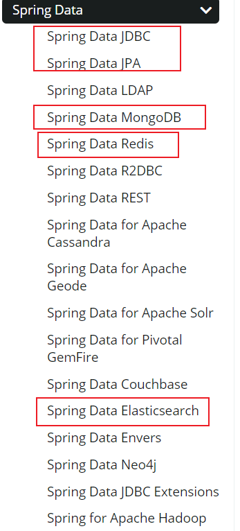

### 1.2 spring data elasticsearch

Spring Data Elasticsearch 基于 spring data API 简化 Elasticsearch操作，将原始操作Elasticsearch的客户端API 进行封装 。Spring Data为Elasticsearch项目提供集成搜索引擎。Spring Data Elasticsearch POJO的关键功能区域为中心的模型与Elastichsearch交互文档和轻松地编写一个存储索引库数据访问层。

### 1.3 spring data elasticsearch版本

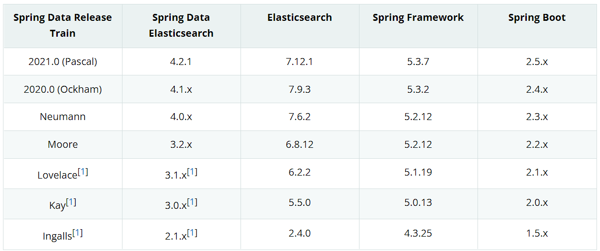

**springboot2.3.x版本可以兼容elasticsearch7.x版本。**

### 1.4 框架集成

#### 1.4.1 依赖

pom.xml

```xml
<parent>
    <artifactId>spring-boot-starter-parent</artifactId>
    <groupId>org.springframework.boot</groupId>
    <version>2.3.6.RELEASE</version>
</parent>
<dependencies>
    <dependency>
        <groupId>org.springframework.boot</groupId>
        <artifactId>spring-boot-starter-web</artifactId>
    </dependency>
    <dependency>
        <groupId>org.projectlombok</groupId>
        <artifactId>lombok</artifactId>
        <optional>true</optional>
    </dependency>
    <dependency>
        <groupId>org.springframework.boot</groupId>
        <artifactId>spring-boot-starter-test</artifactId>
        <scope>test</scope>
    </dependency>
    <dependency>
        <groupId>org.springframework.boot</groupId>
        <artifactId>spring-boot-starter-data-elasticsearch</artifactId>
    </dependency>
</dependencies>
```

#### 1.4.2 yml配置

application.yml

```yaml
spring:
  elasticsearch:
    rest:
      uris: http://localhost:9200
```

#### 1.4.3 document映射

```java
@Data
@Document(indexName = "goods")
public class Goods implements Serializable {

    @Field(type = FieldType.Keyword)
    private String id;
    @Field(type = FieldType.Text)
    private String goodsName;
    @Field(type = FieldType.Integer)
    private Integer store;
    @Field(type = FieldType.Double)
    private double price;

}
```

#### 1.4.4 dao数据访问

```java
@Repository
public interface GoodsDao extends ElasticsearchRepository<Goods, String> {
}
```

#### 1.4.5 springboot启动类

```java
package com.atguigu;

import org.springframework.boot.SpringApplication;
import org.springframework.boot.autoconfigure.SpringBootApplication;

@SpringBootApplication
public class Application {

    public static void main(String[] args) {
        SpringApplication.run(Application.class,args);
    }

}
```

#### 1.4.6 接口测试

```java
	@Autowired
    private GoodsDao goodsDao;

    /**
     * 添加文档
     * */
    @Test
    public void saveTest(){
        Goods goods = new Goods();
        goods.setId("1");
        goods.setGoodsName("华为手机");
        goods.setStore(100);
        goods.setPrice(5000);
        goodsDao.save(goods);
        System.out.println("添加成功...");
    }

    /**
     * 根据ID查询文档
     * */
    @Test
    public void findById(){
        Goods goods = goodsDao.findById("1").get();
        System.out.println(goods);
    }
```

## 2.cap定理

- ***CAP 定理***，又被叫作***布鲁尔定理***。对于设计分布式系统(不仅仅是分布式事务)的架构师来说，CAP 就是你的入门理论。

- 分布式系统（distributed system）正变得越来越重要，大型网站几乎都是分布式的。

- 分布式系统的最大难点，就是各个节点的状态如何同步。CAP 定理是这方面的基本定理，也是理解分布式系统的起点。

 

***C (一致性)***：指数据在多个副本之间能够保持一致的特性（严格的一致性）在分布式系统中的所有数据备份，在同一时刻是否同样的值。（所有节点在同一时间具有相同的数据）

一致性（Consistency）是指多副本（Replications）问题中的数据一致性。可以分为强一致性、与弱一致性。

① 强一致性

***\*简言之，在任意时刻，所有节点中的数据是一样的。\****

例如，对于关系型数据库，要求更新过的数据能被后续的访问都能看到，这是强一致性。

② 弱一致性

数据更新后，如果能容忍后续的访问只能访问到部分或者全部访问不到，则是弱一致性。

***\*最终一致性就属于弱一致性。\****

***A (可用性)***：指系统提供的服务必须一直处于可用的状态，每次只要收到用户的请求，服务器就必须给出回应。在合理的时间内返回合理的响应（不是错误和超时的响应）

***\*只有非故障节点才能满足业务正常；只有在合理的时间内，用户才能接受；只有返回合理的响应，用户才能接受。\****

***P (网络分区容错性)***：网络节点之间无法通信的情况下，节点被隔离，产生了网络分区， 整个系统仍然是可以工作的 . 大多数分布式系统都分布在多个子网络。每个子网络就叫做一个区（partition）。分区容错的意思是，区间通信可能失败。比如，一台服务器放在中国，另一台服务器放在美国，这就是两个区，它们之间可能无法通信。

- 什么是分区？

***\*在分布式系统中，不同的节点分布在不同的子网络中，由于一些特殊的原因，这些子节点之间出现了网络不通的状态，但他们的内部子网络是正常的。从而导致了整个系统的环境被切分成了若干个孤立的区域。这就是分区。\****

- CAP原则的精髓就是要么AP，要么CP，要么AC，但是不存在CAP。

### 2.1 CAP定理的证明

现在我们就来证明一下，为什么不能同时满足三个特性？

假设有两台服务器，一台放着应用A和数据库V，一台放着应用B和数据库V，他们之间的网络可以互通，也就相当于分布式系统的两个部分。

在满足一致性的时候，两台服务器 N1和N2，一开始两台服务器的数据是一样的，DB0=DB0。在满足可用性的时候，用户不管是请求N1或者N2，都会得到立即响应。在满足分区容错性的情况下，N1和N2有任何一方宕机，或者网络不通的时候，都不会影响N1和N2彼此之间的正常运作。

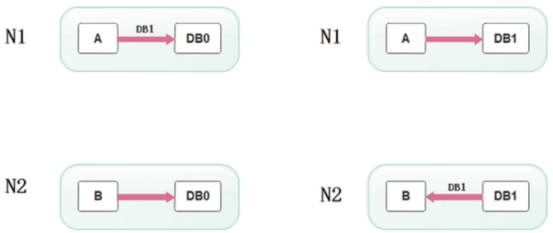 

当用户通过N1中的A应用请求数据更新到服务器DB0后，这时N1中的服务器DB0变为DB1，通过分布式系统的数据同步更新操作，N2服务器中的数据库V0也更新为了DB1，这时，用户通过B向数据库发起请求得到的数据就是即时更新后的数据DB1。

上面是正常运作的情况，但分布式系统中，最大的问题就是网络传输问题，现在假设一种极端情况，N1和N2之间的网络断开了，但我们仍要支持这种网络异常，也就是满足分区容错性，那么这样能不能同时满足一致性和可用性呢？

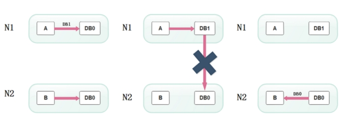 

假设N1和N2之间通信的时候网络突然出现故障，有用户向N1发送数据更新请求，那N1中的数据DB0将被更新为DB1，由于网络是断开的，N2中的数据库仍旧是DB0；

如果这个时候，有用户向N2发送数据读取请求，由于数据还没有进行同步，应用程序没办法立即给用户返回最新的数据DB1，怎么办呢？有二种选择，第一，牺牲数据一致性，响应旧的数据DB0给用户；第二，牺牲可用性，阻塞等待，直到网络连接恢复，数据更新操作完成之后，再给用户响应最新的数据DB1。

上面的过程比较简单，但也说明了要满足分区容错性的分布式系统，只能在一致性和可用性两者中，选择其中一个。也就是说分布式系统不可能同时满足三个特性。这就需要我们在搭建系统时进行取舍了，那么，怎么取舍才是更好的策略呢?

### 2.2 取舍策略

现如今，对于多数大型互联网应用的场景，主机众多、部署分散，而且现在的集群规模越来越大，节点只会越来越多，所以节点故障、网络故障是常态，因此分区容错性也就成为了一个分布式系统必然要面对的问题。那么就只能在C和A之间进行取舍。

***\*原因是\****

因为，在分布式系统中，网络无法 100% 可靠，分区其实是一个必然现象，随着网络节点出现问题，产生了分区, 这时候其他节点和出错节点的数据必然会不一致，这时候就要面临选择，

是选择停掉所有的服务，等网络节点修复后恢复数据，以此来保证一致性（PC）,

还是选择继续提供服务，放弃强一致性的要求，以此来保证整体的可用性（PA）。

所以，最多满足两个条件：

| 组合 | 分析结果                                                     |
| ---- | ------------------------------------------------------------ |
| CA   | 满足原子和可用，放弃分区容错。说白了，就是一个整体的应用。   |
| CP   | 满足原子和分区容错，也就是说，要放弃可用。当系统被分区，为了保证原子性，必须放弃可用性，让服务停用。 |
| AP   | 满足可用性和分区容错，当出现分区，同时为了保证可用性，必须让节点继续对外服务，这样必然导致失去原子性。 |

在分布式系统设计中AP的应用较多，即保证分区容忍性和可用性，牺牲数据的强一致性（写操作后立刻读取到最新数据），保证数据最终一致性。比如：订单退款，今日退款成功，明日账户到账，只要在预定的用户可以接受的时间内退款事务走完即可。

顺便一提，CAP 理论中是忽略网络延迟，也就是当事务提交时，从节点 A 复制到节点 B 没有延迟，但是在现实中这个是明显不可能的，所以总会有一定的时间是不一致。

但是，有个特殊情况需要注意：但对于传统的项目就可能有所不同，拿银行的转账系统来说，涉及到金钱的对于数据一致性不能做出一丝的让步，C必须保证，出现网络故障的话，宁可停止服务，可以在A和P之间做取舍。

***\*总而言之，没有最好的策略，好的系统应该是根据业务场景来进行架构设计的，只有适合的才是最好的。\****

## 3. elasticsearch集群

单台Elasticsearch服务器提供服务，往往都有最大的负载能力，超过这个阈值，服务器性能就会大大降低甚至不可用，所以生产环境中，一般都是运行在指定服务器集群中。

除了负载能力，单点服务器也存在其他问题：

- 单台机器存储容量有限
- 单服务器容易出现单点故障，无法实现高可用
- 单服务的并发处理能力有限

配置服务器集群时，集群中节点数量没有限制，大于等于2个节点就可以看做是集群了。一般出于高性能及高可用方面来考虑集群中节点数量都是3个以上。

### 3.1 集群安装

#### 3.1.1 环境搭建

一般集群建议3台机器以上，这里我们就使用1台机器来安装集群环境。一般生产环境都是使用linux服务器，所以我们这里就是linux环境下安装es集群。

| 节点名称 | 节点IP        | http服务端口 | transport节点通讯端口 |
| -------- | ------------- | ------------ | --------------------- |
| node-1   | 192.168.6.100 | 9201         | 9301                  |
| node-2   | 192.168.6.100 | 9202         | 9302                  |
| node-3   | 192.168.6.100 | 9203         | 9303                  |

**各个机器集群环境安装之前，先把之前的data数据目录删除。**

**node-1:**

```shell
#集群名称
cluster.name: my-application
#节点名称
node.name: node-1
#配置允许的访问网络
network.host: 0.0.0.0
#http服务端口
http.port: 9201
#配置集群间通信的端口号
transport.tcp.port: 9301
#是否允许为主节点，默认true
node.master: true
#是否为数据节点，默认true
node.data: true
#初始配置选举master节点
cluster.initial_master_nodes: ["node-1"]
#节点发现
discovery.seed_hosts: ["localhost:9301", "localhost:9302","localhost:9303"]
#elasticsearch-head 跨域解决
http.cors.allow-origin: "*"
http.cors.enabled: true
```

**node-2:**

```shell
#集群名称
cluster.name: my-application
#节点名称
node.name: node-2
#配置允许的访问网络
network.host: 0.0.0.0
#http服务端口
http.port: 9202
#配置集群间通信的端口号
transport.tcp.port: 9302
#是否允许为主节点，默认true
node.master: true
#是否为数据节点，默认true
node.data: true
#初始配置选举master节点
cluster.initial_master_nodes: ["node-1"]
#节点发现
discovery.seed_hosts: ["localhost:9301", "localhost:9302","localhost:9303"]
```

**node-3:**

```shell
#集群名称
cluster.name: my-application
#节点名称
node.name: node-3
#配置允许的访问网络
network.host: 0.0.0.0
#http服务端口
http.port: 9203
#配置集群间通信的端口号
transport.tcp.port: 9303
#是否允许为主节点，默认true
node.master: true
#是否为数据节点，默认true
node.data: true
#初始配置选举master节点
cluster.initial_master_nodes: ["node-1"]
#节点发现
discovery.seed_hosts: ["localhost:9301", "localhost:9302","localhost:9303"]
```


java 的jvm默认启动内存为1g，要改小一点，不然启动不了三个es,

修改-Xms1g，-Xmx1g这两个

~~~sh
vim jvm.option

-Xms1g
-Xmx1g
~~~


依次启动node-1、node-2、node-3节点。

~~~sh
比如：/bin/elasticsearch -d
~~~


启动完毕后查看节点健康状态:

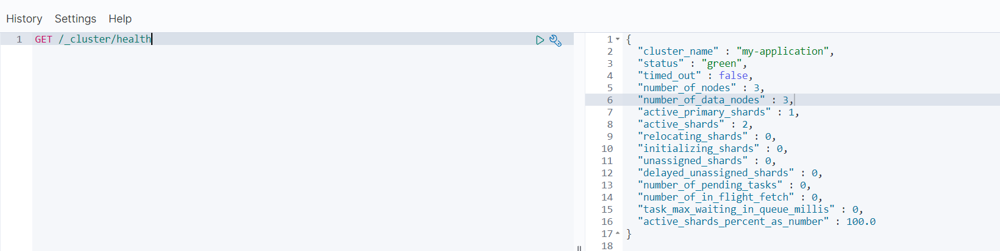

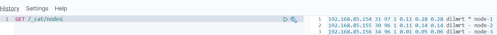

#### 3.1.2 head插件

kibana中查看集群相关的信息不是那么的直观，这里介绍一款第三方浏览器插件(elasticsearch-head)来查看和管理集群。

elasticsearch-head是一个nodesjs项目，所以要先安装nodejs环境。

##### nodejs安装

```shell
#下载nodejs(可以直接copy资料中的node-v12.18.1-linux-x64.tar.xz):
#注意:我的软件放在/opt目录下。
wget https://nodejs.org/dist/v12.18.1/node-v12.18.1-linux-x64.tar.xz

#解压文件：
tar -Jxf node-v12.18.1-linux-x64.tar.xz
mv  node-v12.18.1-linux-x64 nodejs

#配置软链接环境(注意目录地址是否正确)：
ln -s /opt/nodejs/bin/node /usr/local/bin/node
ln -s /opt/nodejs/bin/npm /usr/local/bin/npm
```

验证nodejs环境(node -v):

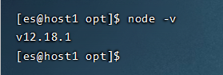

##### elasticsearch-head插件安装

```shell
#上传资料中的文件(该文件是nodejs编译后的)elasticsearch-head-compile-after.tar.gz
#1.解压文件
tar zxvf elasticsearch-head-compile-after.tar.gz

#2.修改Gruntfile.js(/解压目录/Gruntfile.js)找到代码中的93行[:93],将192.168.100.100修改为自己的IP
 server: {
     options: {
         hostname: '192.168.6.100',
         port: 9100,
         base: '.',
         keepalive: true
     }
 }
 
#3.修改app.js(/解压目录/_stie/app.js)找到4354行[:4354],将http://localhost:9200修改为对应的IP
this.base_uri = this.config.base_uri || this.prefs.get("app-base_uri") || "http://192.168.6.100:9200";

#4.启动head(/opt/es/elasticsearch-head为解压目录)
cd /opt/es/elasticsearch-head/node_modules/grunt
#后台启动
nohup ./grunt server >/dev/null 2>&1 &
```

测试访问(head端口9100):http://192.1686.100:9100/

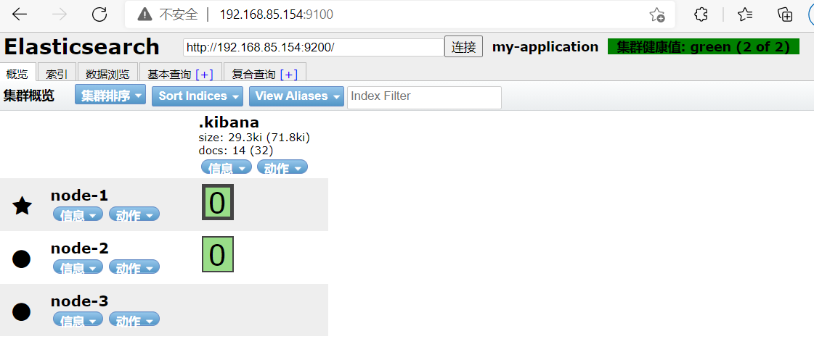

### 3.2 elasticsearch中的集群核心概念

#### 集群Cluster

一个集群就是由一个或多个服务器节点组织在一起，共同持有整个的数据，并一起提供索引和搜索功能。一个Elasticsearch集群有一个唯一的名字标识，这个名字默认就是”elasticsearch”。这个名字是重要的，因为一个节点只能通过指定某个集群的名字，来加入这个集群。

#### 节点Node

​	集群中包含很多服务器，一个节点就是其中的一个服务器。作为集群的一部分，它存储数据，参与集群的索引和搜索功能。

​	一个节点也是由一个名字来标识的，默认情况下，这个名字是一个随机的漫威漫画角色的名字，这个名字会在启动的时候赋予节点。这个名字对于管理工作来说挺重要的，因为在这个管理过程中，你会去确定网络中的哪些服务器对应于Elasticsearch集群中的哪些节点。

​	一个节点可以通过配置集群名称的方式来加入一个指定的集群。默认情况下，每个节点都会被安排加入到一个叫做“elasticsearch”的集群中，这意味着，如果你在你的网络中启动了若干个节点，并假定它们能够相互发现彼此，它们将会自动地形成并加入到一个叫做“elasticsearch”的集群中。

​	在一个集群里，只要你想，可以拥有任意多个节点。而且，如果当前你的网络中没有运行任何Elasticsearch节点，这时启动一个节点，会默认创建并加入一个叫做“elasticsearch”的集群。

#### 分片(Shards)

​	一个索引可以存储超出单个节点硬件限制的大量数据。比如，一个具有10亿文档数据的索引占据1TB的磁盘空间，而任一节点都可能没有这样大的磁盘空间。或者单个节点处理搜索请求，响应太慢。为了解决这个问题，Elasticsearch提供了将索引划分成多份的能力，每一份就称之为分片。当你创建一个索引的时候，你可以指定你想要的分片的数量。每个分片本身也是一个功能完善并且独立的“索引”，这个“索引”可以被放置到集群中的任何节点上。

分片很重要，主要有两方面的原因：

1）允许你水平分割 / 扩展你的内容容量。

2）允许你在分片之上进行分布式的、并行的操作，进而提高性能/吞吐量。

至于一个分片怎样分布，它的文档怎样聚合和搜索请求，是完全由Elasticsearch管理的，对于作为用户的你来说，这些都是透明的，无需过分关心。

#### 副本(Replicas)

​	在一个网络 / 云的环境里，失败随时都可能发生，在某个分片/节点不知怎么的就处于离线状态，或者由于任何原因消失了，这种情况下，有一个故障转移机制是非常有用并且是强烈推荐的。为此目的，Elasticsearch允许你创建分片的一份或多份拷贝，这些拷贝叫做复制分片(副本)。

​	复制分片之所以重要，有两个主要原因：

- 在分片/节点失败的情况下，提供了高可用性。因为这个原因，注意到复制分片从不与原/主要（original/primary）分片置于同一节点上是非常重要的。
- 扩展你的搜索量/吞吐量，因为搜索可以在所有的副本上并行运行。

总之，每个索引可以被分成多个分片。一个索引也可以被复制0次（意思是没有复制）或多次。一旦复制了，每个索引就有了主分片（作为复制源的原来的分片）和复制分片（主分片的拷贝）之别。分片和复制的数量可以在索引创建的时候指定。在索引创建之后，你可以在任何时候动态地改变复制的数量，但是你事后不能改变分片的数量。默认情况下，Elasticsearch中的每个索引被分片1个主分片和1个复制，这意味着，如果你的集群中至少有两个节点，你的索引将会有1个主分片和另外1个复制分片（1个完全拷贝），这样的话每个索引总共就有2个分片，我们需要根据索引需要确定分片个数。

#### 分配(Allocation)

将分片分配给某个节点的过程，包括分配主分片或者副本。如果是副本，还包含从主分片复制数据的过程。这个过程是由master节点完成的。

#### 节点类型

es集群中的节点类型分为:Master、DataNode。

- master:

  Elasticsearch启动时，会选举出来一个Master节点。当某个节点启动后,使用Zen Discovery机制找到集群中的其他节点，并建立连接。 

  discovery.seed_hosts: ["host1", "host2", "host3"] 

  并从候选主节点中选举出一个主节点。 

  cluster.initial_master_nodes: ["node-1", "node-2","node-3"]

  > Master节点主要负责： 
  >
  > - 管理索引（创建索引、删除索引）、分配分片 
  >
  > - 维护元数据 
  >
  > - 管理集群节点状态 
  >
  > 不负责数据写入和查询，比较轻量级。一个ElasticSearch集群中，只有一个Master节点。在生产环境中，内存可以相对 
  >
  > 小一点，但要确保机器稳定。

- DataNode:

  在Elasticsearch集群中，会有N个DataNode节点。DataNode节点主要负责： 

  - 数据写入、数据检索，大部分Elasticsearch的压力都在DataNode节点上 

  在生产环境中，内存最好配置大一些。

### 3.3 系统架构

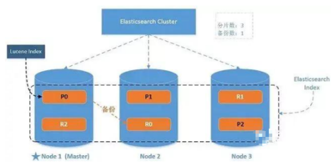

​	一个运行中的 Elasticsearch 实例称为一个节点，而集群是由一个或者多个拥有相同 cluster.name 配置的节点组成， 它们共同承担数据和负载的压力。当有节点加入集群中或者从集群中移除节点时，集群将会重新平均分布所有的数据。

​	当一个节点被选举成为主节点时， 它将负责管理集群范围内的所有变更，例如增加、删除索引，或者增加、删除节点等。 而主节点并不需要涉及到文档级别的变更和搜索等操作，所以当集群只拥有一个主节点的情况下，即使流量的增加它也不会成为瓶颈。 任何节点都可以成为主节点。我们的示例集群就只有一个节点，所以它同时也成为了主节点。

​	作为用户，我们可以将请求发送到集群中的任何节点 ，包括主节点。 每个节点都知道任意文档所处的位置，并且能够将我们的请求直接转发到存储我们所需文档的节点。 无论我们将请求发送到哪个节点，它都能负责从各个包含我们所需文档的节点收集回数据，并将最终结果返回給客户端。 Elasticsearch 对这一切的管理都是透明的。

### 3.4 elasticsearch分片

我们可以在建立索引的时候创建分片信息：

```shell
#number_of_shards：主分片数量(7.x版本之后如果不指定数量默认为1),number_of_replicas：每个主分片对应的副本数量
PUT /users
{
  "settings": {
    "number_of_shards": 3,
    "number_of_replicas": 2
  }
}
```

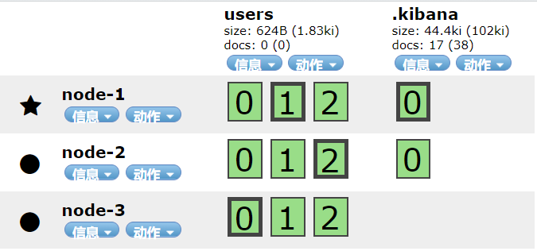

head中数据查看说明:

★ 代表当前节点为master节点

● 表示DataNode节点

**粗线框格子为主分片，细线框为副本分片，主分片与副本分片不能同时在一台机器上。**

> 刚才的例子中，我们创建了3个主分片，然后又为每个主分片配置了两个副本分片，加起来一共9个分片。分片序号分别为0、1、2代表不同的数据段存储。其中0号分片的主分片在node-3机器上，node-1和node-2是它的备份分片。

**<font color='red'>注意:主分片数量一旦指定后就不允许更改，否则会影响后续的数据操作(分片位置路由是取模主分片数量)。</font>**

虽然主分片数量不可用更改，但是副本数量可以修改:

```json
#修改副本数
PUT users/_settings
{
  "number_of_replicas": 0
}
```

### 3.5 分片控制

#### 3.5.1 写流程

**新建和删除请求都是写操作， 必须在主分片上面完成之后才能被复制到相关的副本分片**

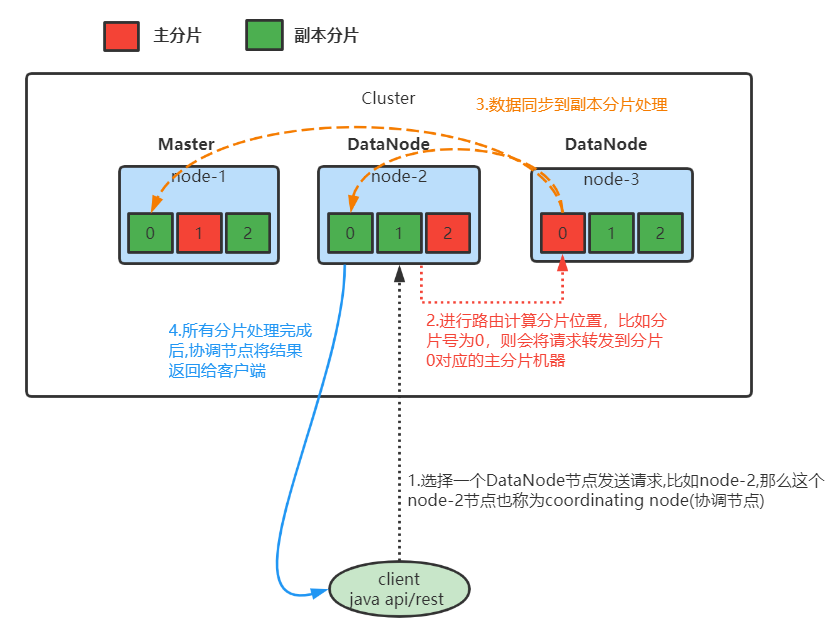

- 第一步: 客户端选择DataNode节点发送请求，如上图架构，假设发送到node-2节点上。此时被选择的node-2节点也称为coordinating node(协调节点)
- 第二步: 协调节点根据路由规则计算分片索引位置。并将请求发送到分片索引对应的主分片机器上(这里假设分片计算后的值为0，那么请求会命中到node-3节点上)。
  - 计算分片索引位置: shard = hash(routing) % number_of_primary_shards,routing可以自己设定，一般默认为文档的ID。

- 第三步: 当主分片文档写入完成后，同时将数据推送到与之对应的副本分片进行写入操作
- 第四步: 当分片完成了写入后再由协调节点将操作结果返回给客户端

#### 3.5.2 读流程

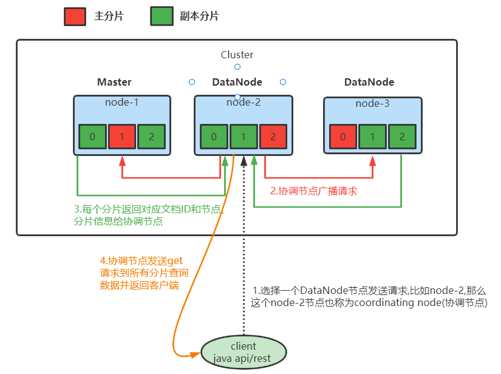

- 第一步:客户端选择DataNode节点发送请求，如上图架构，假设发送到node-2节点上。此时被选择的node-2节点也称为coordinating node(协调节点)
- 第二步: 协调节点将从客户端获取到的请求数据转发到其它节点
- 第三步: 其它节点将查询结果文档ID、节点、分片信息返回给协调节点
- 第四步: 协调节点通过文档ID、节点信息等发送get请求给其它节点进行数据获取，最后进行汇总排序将数据返回给客户端

## 4.分片原理

### 4.1 倒排索引

Elasticsearch 使用一种称为***\*倒排索引\****的结构，它适用于快速的全文搜索。

见其名，知其意，有倒排索引，肯定会对应有正向索引。正向索引（forward index），反向索引（inverted index）更熟悉的名字是倒排索引。

所谓的正向索引，就是搜索引擎会将待搜索的文件都对应一个文件ID，搜索时将这个ID和搜索关键字进行对应，形成K-V对，然后对关键字进行统计计数

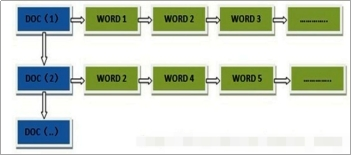 

但是互联网上收录在搜索引擎中的文档的数目是个天文数字，这样的索引结构根本无法满足实时返回排名结果的要求。所以，搜索引擎会将正向索引重新构建为倒排索引，即把文件ID对应到关键词的映射转换为关键词到文件ID的映射，每个关键词都对应着一系列的文件，这些文件中都出现这个关键词。

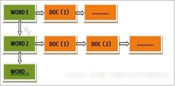 

一个倒排索引由文档中所有不重复词的列表构成，对于其中每个词，有一个包含它的文档列表。例如，假设我们有两个文档，每个文档的 content 域包含如下内容：

- The quick brown fox jumped over the lazy dog

- Quick brown foxes leap over lazy dogs in summer

为了创建倒排索引，我们首先将每个文档的 content 域拆分成单独的 词（我们称它为 词条 或 tokens ），创建一个包含所有不重复词条的排序列表，然后列出每个词条出现在哪个文档。结果如下所示：

 

现在，如果我们想搜索 quick brown ，我们只需要查找包含每个词条的文档：

 

两个文档都匹配，但是第一个文档比第二个匹配度更高。如果我们使用仅计算匹配词条数量的简单相似性算法，那么我们可以说，对于我们查询的相关性来讲，第一个文档比第二个文档更佳。

### 4.2 文档搜索

早期的全文检索会为整个文档集合建立一个很大的倒排索引并将其写入到磁盘。 一旦新的索引就绪，旧的就会被其替换，这样最近的变化便可以被检索到。

倒排索引被写入磁盘后是 不可改变 的:它永远不会修改。 

不变性有重要的价值：

- 不需要锁。如果你从来不更新索引，你就不需要担心多进程同时修改数据的问题。

- 一旦索引被读入内核的文件系统缓存，便会留在哪里，由于其不变性。只要文件系统缓存中还有足够的空间，那么大部分读请求会直接请求内存，而不会命中磁盘。这提供了很大的性能提升。

- 其它缓存(像filter缓存)，在索引的生命周期内始终有效。它们不需要在每次数据改变时被重建，因为数据不会变化。

- 写入单个大的倒排索引允许数据被压缩，减少磁盘 I/O 和 需要被缓存到内存的索引的使用量。

当然，一个不变的索引也有不好的地方。主要事实是它是不可变的! 你不能修改它。如果你需要让一个新的文档可被搜索，你需要重建整个索引。这要么对一个索引所能包含的数据量造成了很大的限制，要么对索引可被更新的频率造成了很大的限制。

### 4.3 动态更新索引

如何在保留不变性的前提下实现倒排索引的更新？

答案是: **用更多的索引。**通过增加新的补充索引来反映新近的修改，而不是直接重写整个倒排索引。每一个倒排索引都会被轮流查询到，从最早的开始查询完后再对结果进行合并。

Elasticsearch 基于 Lucene, 这个java库引入了***按段搜索***的概念。 每一 段本身都是一个倒排索引。 但索引在 Lucene 中除表示所有段的集合外， 还增加了提交点的概念 — 一个列出了所有已知段的文件。

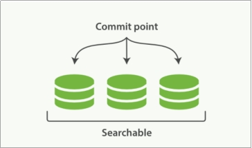 

***按段搜索***会以如下流程执行：

1. 新文档被收集到内存索引缓存

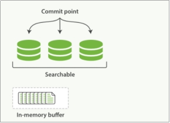 

2. 不时地, 缓存被 提交 

(1) 一个新的段—一个追加的倒排索引—被写入磁盘。

(2) 一个新的包含新段名字的 提交点 被写入磁盘

(3) 磁盘进行同步 — 所有在文件系统缓存中等待的写入都刷新到磁盘，以确保它们被写入物理文件

3. 新的段被开启，让它包含的文档可见以被搜索

4. 内存缓存被清空，等待接收新的文档 

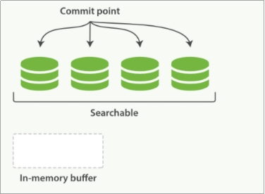 

当一个查询被触发，所有已知的段按顺序被查询。词项统计会对所有段的结果进行聚合，以保证每个词和每个文档的关联都被准确计算。 这种方式可以用相对较低的成本将新文档添加到索引。

段是不可改变的，所以既不能把文档从旧的段中移除，也不能修改旧的段来进行反映文档的更新。 取而代之的是，每个提交点会包含一个 .del 文件，文件中会列出这些被删除文档的段信息。

当一个文档被 “删除” 时，它实际上只是在 .del 文件中被标记删除。一个被标记删除的文档仍然可以被查询匹配到，但它会在最终结果被返回前从结果集中移除。

文档更新也是类似的操作方式：当一个文档被更新时，旧版本文档被标记删除，文档的新版本被索引到一个新的段中。 可能两个版本的文档都会被一个查询匹配到，但被删除的那个旧版本文档在结果集返回前就已经被移除。

### 4.4 近实时搜索

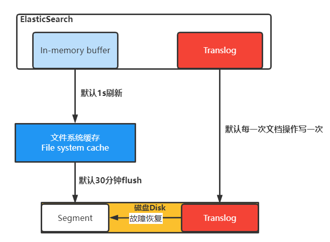

- 分段数据先写入到内存缓存中，同时文档操作也会记录translog日志
- 内存的数据对查询不可见，默认间隔1s将内存中数据写入到文件系统缓存中，这里面的数据对查询可见。
- 文件系统缓存数据间隔30分钟再将数据刷入磁盘中。
- 如果文件系统缓存数据在没有刷新到硬盘时宕机了，可以从translog中恢复数据到磁盘，数据恢复完成后translog数据也会清理。

### 4.5 段合并

​	由于自动刷新流程每秒会创建一个新的段 ，这样会导致短时间内的段数量暴增。而段数目太多会带来较大的麻烦。 每一个段都会消耗文件句柄、内存和cpu运行周期。更重要的是，每个搜索请求都必须轮流检查每个段；所以段越多，搜索也就越慢。

​	Elasticsearch通过在后台进行段合并来解决这个问题。小的段被合并到大的段，然后这些大的段再被合并到更大的段。

​	段合并的时候会将那些旧的已删除文档从文件系统中清除。被删除的文档（或被更新文档的旧版本）不会被拷贝到新的大段中。

​	启动段合并不需要你做任何事。进行索引和搜索时会自动进行。

1. 当索引的时候，刷新（refresh）操作会创建新的段并将段打开以供搜索使用。

2. 合并进程选择一小部分大小相似的段，并且在后台将它们合并到更大的段中。这并不会中断索引和搜索。

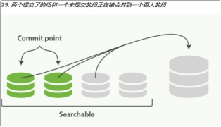 

3. 一旦合并结束，老的段被删除

- 新的段被刷新（flush）到了磁盘。  ** 写入一个包含新段且排除旧的和较小的段的新提交点。

- 新的段被打开用来搜索。

- 老的段被删除。

 

合并大的段需要消耗大量的I/O和CPU资源，如果任其发展会影响搜索性能。Elasticsearch在默认情况下会对合并流程进行资源限制，所以搜索仍然 有足够的资源很好地执行。

## 5.优化建议

### 5.1 硬件选择

Elasticsearch的基础是 Lucene，所有的索引和文档数据是存储在本地的磁盘中，具体的路径可在 ES 的配置文件../config/elasticsearch.yml中配置，如下：

\#----------------------------------- Paths ------------------------------------

\#

\# Path to directory where to store the data (separate multiple locations by comma):

\#

\#path.data: /path/to/data

\#

\# Path to log files:

\#

\#path.logs: /path/to/logs

\#

磁盘在现代服务器上通常都是瓶颈。Elasticsearch 重度使用磁盘，你的磁盘能处理的吞吐量越大，你的节点就越稳定。这里有一些优化磁盘 I/O 的技巧：

l 使用 SSD。就像其他地方提过的， 他们比机械磁盘优秀多了。

l 使用 RAID 0。条带化 RAID 会提高磁盘 I/O，代价显然就是当一块硬盘故障时整个就故障了。不要使用镜像或者奇偶校验 RAID 因为副本已经提供了这个功能。

l 另外，使用多块硬盘，并允许 Elasticsearch 通过多个 path.data 目录配置把数据条带化分配到它们上面。

l 不要使用远程挂载的存储，比如 NFS 或者 SMB/CIFS。这个引入的延迟对性能来说完全是背道而驰的。

### 5.2 分片策略

#### 5.2.1 合理设置分片数

分片和副本的设计为 ES 提供了支持分布式和故障转移的特性，但并不意味着分片和副本是可以无限分配的。而且索引的分片完成分配后由于索引的路由机制，我们是不能重新修改分片数的。

可能有人会说，我不知道这个索引将来会变得多大，并且过后我也不能更改索引的大小，所以为了保险起见，还是给它设为 1000 个分片吧。但是需要知道的是，一个分片并不是没有代价的。需要了解：

l 一个分片的底层即为一个 Lucene 索引，会消耗一定文件句柄、内存、以及 CPU 运转。

l 每一个搜索请求都需要命中索引中的每一个分片，如果每一个分片都处于不同的节点还好， 但如果多个分片都需要在同一个节点上竞争使用相同的资源就有些糟糕了。

l 用于计算相关度的词项统计信息是基于分片的。如果有许多分片，每一个都只有很少的数据会导致很低的相关度。

一个业务索引具体需要分配多少分片可能需要架构师和技术人员对业务的增长有个预先的判断，横向扩展应当分阶段进行。为下一阶段准备好足够的资源。 只有当你进入到下一个阶段，你才有时间思考需要作出哪些改变来达到这个阶段。一般来说，我们遵循一些原则：

l 控制每个分片占用的硬盘容量不超过ES的最大JVM的堆空间设置（一般设置不超过32G，参考下文的JVM设置原则），因此，如果索引的总容量在500G左右，那分片大小在16个左右即可；当然，最好同时考虑原则2。

l 考虑一下node数量，一般一个节点有时候就是一台物理机，如果分片数过多，大大超过了节点数，很可能会导致一个节点上存在多个分片，一旦该节点故障，即使保持了1个以上的副本，同样有可能会导致数据丢失，集群无法恢复。所以， 一般都设置分片数不超过节点数的3倍。

l 主分片，副本和节点最大数之间数量，我们分配的时候可以参考以下关系：

节点数<=主分片数*（副本数+1）

#### 5.2.2 推迟分片分配

对于节点瞬时中断的问题，默认情况，集群会等待一分钟来查看节点是否会重新加入，如果这个节点在此期间重新加入，重新加入的节点会保持其现有的分片数据，不会触发新的分片分配。这样就可以减少 ES 在自动再平衡可用分片时所带来的极大开销。

通过修改参数 delayed_timeout ，可以延长再均衡的时间，可以全局设置也可以在索引级别进行修改:

```json
PUT /_all/_settings 

{
 "settings": {
  "index.unassigned.node_left.delayed_timeout": "5m" 
 }
}
```

### 5.3 路由选择

当我们查询文档的时候，Elasticsearch 如何知道一个文档应该存放到哪个分片中呢？它其实是通过下面这个公式来计算出来:

shard = hash(routing) % number_of_primary_shards

routing 默认值是文档的 id，也可以采用自定义值，比如用户 id。

***不带 routing 查询***

在查询的时候因为不知道要查询的数据具体在哪个分片上，所以整个过程分为 2 个步骤

- 分发：请求到达协调节点后，协调节点将查询请求分发到每个分片上。

- 聚合: 协调节点搜集到每个分片上查询结果，在将查询的结果进行排序，之后给用户返回结果。

***带 routing 查询***

查询的时候，可以直接根据 routing 信息定位到某个分配查询，不需要查询所有的分配，经过协调节点排序。

向上面自定义的用户查询，如果 routing 设置为 userid 的话，就可以直接查询出数据来，效率提升很多。

### 5.4 写入速度优化

ES的默认配置，是综合了数据可靠性、写入速度、搜索实时性等因素。实际使用时，我们需要根据公司要求，进行偏向性的优化。

针对于搜索性能要求不高，但是对写入要求较高的场景，我们需要尽可能的选择恰当写优化策略。综合来说，可以考虑以下几个方面来提升写索引的性能：

- 加大 Translog Flush ，目的是降低 Iops、Writeblock。

- 增加 Index Refresh 间隔，目的是减少 Segment Merge 的次数。

- 调整 Bulk 线程池和队列。

- 优化节点间的任务分布。

- 优化 Lucene 层的索引建立，目的是降低 CPU 及 IO。

#### 5.4.1 批量数据提交

ES 提供了 Bulk API 支持批量操作，当我们有大量的写任务时，可以使用 Bulk 来进行批量写入。

通用的策略如下：Bulk 默认设置批量提交的数据量不能超过 100M。数据条数一般是根据文档的大小和服务器性能而定的，但是单次批处理的数据大小应从 5MB～15MB 逐渐增加，当性能没有提升时，把这个数据量作为最大值。

#### 5.4.2 优化存储设备

ES 是一种密集使用磁盘的应用，在段合并的时候会频繁操作磁盘，所以对磁盘要求较高，当磁盘速度提升之后，集群的整体性能会大幅度提高。

#### 5.4.3 减少Refresh的次数

Lucene 在新增数据时，采用了延迟写入的策略，默认情况下索引的 refresh_interval 为 1 秒。

Lucene 将待写入的数据先写到内存中，超过 1 秒（默认）时就会触发一次 Refresh，然后 Refresh 会把内存中的的数据刷新到操作系统的文件缓存系统中。

如果我们对搜索的实效性要求不高，可以将 Refresh 周期延长，例如 30 秒。

这样还可以有效地减少段刷新次数，但这同时意味着需要消耗更多的Heap内存。

#### 5.4.4 加大Flush设置

Flush 的主要目的是把文件缓存系统中的段持久化到硬盘，当 Translog 的数据量达到 512MB 或者 30 分钟时，会触发一次 Flush。

index.translog.flush_threshold_size 参数的默认值是 512MB，我们进行修改。

增加参数值意味着文件缓存系统中可能需要存储更多的数据，所以我们需要为操作系统的文件缓存系统留下足够的空间。

#### 5.4.5 减少副本的数量

ES 为了保证集群的可用性，提供了 Replicas（副本）支持，然而每个副本也会执行分析、索引及可能的合并过程，所以 Replicas 的数量会严重影响写索引的效率。

当写索引时，需要把写入的数据都同步到副本节点，副本节点越多，写索引的效率就越慢。

如果我们需要大批量进行写入操作，可以先禁止 Replica 复制，设置 index.number_of_replicas: 0 关闭副本。在写入完成后，Replica 修改回正常的状态。

#### 5.4.6 内存设置

ES 默认安装后设置的内存是 1GB，对于任何一个现实业务来说，这个设置都太小了。

如果是通过解压安装的 ES，则在 ES 安装文件中包含一个 jvm.option 文件，添加如下命令来设置 ES 的堆大小，Xms 表示堆的初始大小，Xmx 表示可分配的最大内存，都是 1GB。

确保 Xmx 和 Xms 的大小是相同的，其目的是为了能够在 Java 垃圾回收机制清理完堆区后不需要重新分隔计算堆区的大小而浪费资源，可以减轻伸缩堆大小带来的压力。

假设你有一个 64G 内存的机器，按照正常思维思考，你可能会认为把 64G 内存都给 ES 比较好，但现实是这样吗， 越大越好？虽然内存对 ES 来说是非常重要的，但是答案是否定的！

因为 ES 堆内存的分配需要满足以下两个原则：

- 不要超过物理内存的 50%：Lucene 的设计目的是把底层 OS 里的数据缓存到内存中。

Lucene 的段是分别存储到单个文件中的，这些文件都是不会变化的，所以很利于缓存，同时操作系	统也会把这些段文件缓存起来，以便更快的访问。

如果我们设置的堆内存过大，Lucene 可用的内存将会减少，就会严重影响降低 Lucene 的全文本查	询性能。

- 堆内存的大小最好不要超过 32GB：在 Java 中，所有对象都分配在堆上，然后有一个 Klass Pointer 指针指向它的类元数据。

这个指针在 64 位的操作系统上为 64 位，64 位的操作系统可以使用更多的内存（2^64）。在 32 位	的系统上为 32 位，32 位的操作系统的最大寻址空间为 4GB（2^32）。

但是 64 位的指针意味着更大的浪费，因为你的指针本身大了。浪费内存不算，更糟糕的是，更大的	指针在主内存和缓存器（例如 LLC, L1等）之间移动数据的时候，会占用更多的带宽。

最终我们都会采用 31 G 设置

-Xms 31g

-Xmx 31g

假设你有个机器有 128 GB 的内存，你可以创建两个节点，每个节点内存分配不超过 32 GB。 也就是说不超过 64 GB 内存给 ES 的堆内存，剩下的超过 64 GB 的内存给 Lucene

### 5.5 重要配置

| 参数名                             | 参数值        | 说明                                                         |
| ---------------------------------- | ------------- | ------------------------------------------------------------ |
| cluster.name                       | elasticsearch | 配置 ES 的集群名称，默认值是ES，建议改成与所存数据相关的名称，ES 会自动发现在同一网段下的集群名称相同的节点 |
| node.name                          | node-1        | 集群中的节点名，在同一个集群中不能重复。节点的名称一旦设置，就不能再改变了。当然，也可以设置成服务器的主机名称，例如 node.name:${HOSTNAME}。 |
| node.master                        | true          | 指定该节点是否有资格被选举成为 Master 节点，默认是 True，如果被设置为 True，则只是有资格成为 Master 节点，具体能否成为 Master 节点，需要通过选举产生。 |
| node.data                          | true          | 指定该节点是否存储索引数据，默认为 True。数据的增、删、改、查都是在 Data 节点完成的。 |
| index.number_of_shards             | 1             | 设置都索引分片个数，默认是 1 片。也可以在创建索引时设置该值，具体设置为多大都值要根据数据量的大小来定。如果数据量不大，则设置成 1 时效率最高 |
| index.number_of_replicas           | 1             | 设置默认的索引副本个数，默认为 1 个。副本数越多，集群的可用性越好，但是写索引时需要同步的数据越多。 |
| transport.tcp.compress             | true          | 设置在节点间传输数据时是否压缩，默认为 False，不压缩         |
| discovery.zen.minimum_master_nodes | 1             | 设置在选举 Master 节点时需要参与的最少的候选主节点数，默认为 1。如果使用默认值，则当网络不稳定时有可能会出现脑裂。合理的数值为(master_eligible_nodes/2)+1，其中 master_eligible_nodes 表示集群中的候选主节点数 |
| discovery.zen.ping.timeout         | 3s            | 设置在集群中自动发现其他节点时 Ping 连接的超时时间，默认为 3 秒。在较差的网络环境下需要设置得大一点，防止因误判该节点的存活状态而导致分片的转移 |

## 6.面试题

### 6.1 为什么要使用Elasticsearch?

系统中的数据，随着业务的发展，时间的推移，将会非常多，而业务中往往采用模糊查询进行数据的搜索，而模糊查询会导致查询引擎放弃索引，导致系统查询数据时都是全表扫描，在百万级别的数据库中，查询效率是非常低下的，而我们使用ES做一个全文索引，将经常查询的系统功能的某些字段，比如说电商系统的商品表中商品名，描述、价格还有id这些字段我们放入ES索引库里，可以提高查询速度。

### 6.2 Elasticsearch的master选举流程？

参考: https://blog.csdn.net/qq_33330687/article/details/105681994

#### 7.x之前选主流程

采用Bully算法，它假定所有节点都有一个唯一的ID，使用该ID对节点进行排序。任何时候的当前Leader都是参与集群的最高ID节点。该算法的优点是易于实现。但是，当拥有最大ID的节点处于不稳定状态的场景下会有问题。例如，Master负载过重而假死，集群拥有第二大ID的节点被选为新主，这时原来的Master恢复，再次被选为新主，然后又假死。
ES 通过推迟选举，直到当前的 Master 失效来解决上述问题，只要当前主节点不挂掉，就不重新选主。但是容易产生脑裂（双主），为此，再通过“法定得票人数过半”解决脑裂问题。

#### 7.x之后选主流程

7.X之后的ES，采用一种新的选主算法，实际上是 Raft 的实现，但并非严格按照 Raft 论文实现，而是做了一些调整。

raft选举过程:

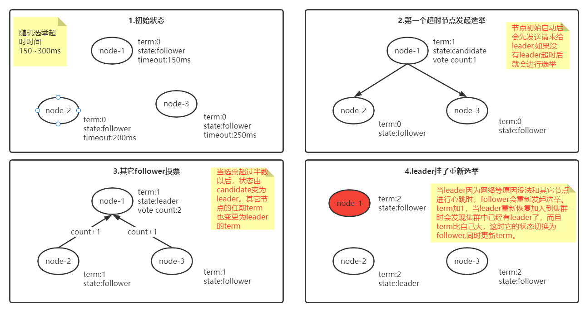

- 选举超时时间:150~300ms的随机数
- term每次选举+1
- 同一个任期内每个节点只能有一张选票
- 选票超过半数则当选为leader
- 当leader被选举后，其它剩余投票将废弃

### 6.3 Elasticsearch集群脑裂问题？

***“脑裂”问题可能的成因:***

- 网络问题：集群间的网络延迟导致一些节点访问不到master，认为master挂掉了从而选举出新的master，并对master上的分片和副本标红，分配新的主分片

- 节点负载：主节点的角色既为master又为data，访问量较大时可能会导致ES停止响应造成大面积延迟，此时其他节点得不到主节点的响应认为主节点挂掉了，会重新选取主节点。

- 内存回收：data节点上的ES进程占用的内存较大，引发JVM的大规模内存回收，造成ES进程失去响应。

***脑裂问题解决方案：***

***减少误判：***discovery.zen.ping_timeout节点状态的响应时间，默认为3s，可以适当调大，如果master在该响应时间的范围内没有做出响应应答，判断该节点已经挂掉了。调大参数（如6s，discovery.zen.ping_timeout:6），可适当减少误判。

***选举触发***: discovery.zen.minimum_master_nodes:1

> 7.x之前版本:
>
> 该参数是用于控制选举行为发生的最小集群主节点数量。当备选主节点的个数大于等于该参数的值，	且备选主节点中有该参数个节点认为主节点挂了，进行选举。官方建议为（n/2）+1，n为主节点个数	（即有资格成为主节点的节点个数）
>
> 7.x之后版本:
>
> 不需要手动配置，系统自己会维护最小集群节点数

***角色分离***：即master节点与data节点分离，限制角色

主节点配置为：node.master: true node.data: false

从节点配置为：node.master: false node.data: true

### 6.4 Elasticsearch索引文档的流程？

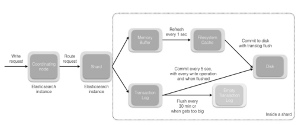 

- 协调节点默认使用文档ID参与计算（也支持通过routing），以便为路由提供合适的分片：

***\*shard = hash(document_id) % (num_of_primary_shards)\****

- 当分片所在的节点接收到来自协调节点的请求后，会将请求写入到Memory Buffer，然后定时（默认是每隔1秒）写入到Filesystem Cache，这个从Memory Buffer到Filesystem Cache的过程就叫做refresh；

- 当然在某些情况下，存在Momery Buffer和Filesystem Cache的数据可能会丢失，ES是通过translog的机制来保证数据的可靠性的。其实现机制是接收到请求后，同时也会写入到translog中，当Filesystem cache中的数据写入到磁盘中时，才会清除掉，这个过程叫做flush；

- 在flush过程中，内存中的缓冲将被清除，内容被写入一个新段，段的fsync将创建一个新的提交点，并将内容刷新到磁盘，旧的translog将被删除并开始一个新的translog。

- flush触发的时机是定时触发（默认30分钟）或者translog变得太大（默认为512M）时；

### 6.5 **Elasticsearch更新和删除文档的流程？**

- 删除和更新也都是写操作，但是Elasticsearch中的文档是不可变的，因此不能被删除或者改动以展示其变更；

- 磁盘上的每个段都有一个相应的.del文件。当删除请求发送后，文档并没有真的被删除，而是在.del文件中被标记为删除。该文档依然能匹配查询，但是会在结果中被过滤掉。当段合并时，在.del文件中被标记为删除的文档将不会被写入新段。

- 在新的文档被创建时，Elasticsearch会为该文档指定一个版本号，当执行更新时，旧版本的文档在.del文件中被标记为删除，新版本的文档被索引到一个新段。旧版本的文档依然能匹配查询，但是会在结果中被过滤掉。

 

### 6.6 Elasticsearch搜索的流程？

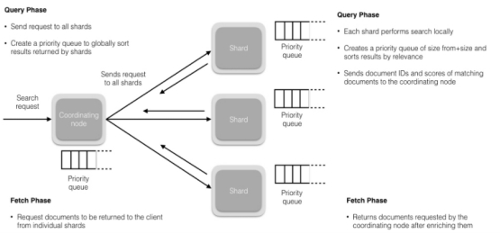 

- 搜索被执行成一个两阶段过程，我们称之为 Query Then Fetch；

- 在初始查询阶段时，查询会广播到索引中每一个分片拷贝（主分片或者副本分片）。 每个分片在本地执行搜索并构建一个匹配文档的大小为 from + size 的优先队列。PS：在搜索的时候是会查询Filesystem Cache的，但是有部分数据还在Memory Buffer，所以搜索是近实时的。

- 每个分片返回各自优先队列中 所有文档的 ID 和排序值 给协调节点，它合并这些值到自己的优先队列中来产生一个全局排序后的结果列表。

- 接下来就是取回阶段，协调节点辨别出哪些文档需要被取回并向相关的分片提交多个 GET 请求。每个分片加载并丰富文档，如果有需要的话，接着返回文档给协调节点。一旦所有的文档都被取回了，协调节点返回结果给客户端。

### 6.7 Elasticsearch 在部署时，对 Linux 的设置有哪些优化方法？

- 64 GB 内存的机器是非常理想的， 但是32 GB 和16 GB 机器也是很常见的。少于8 GB 会适得其反。

- 如果你要在更快的 CPUs 和更多的核心之间选择，选择更多的核心更好。多个内核提供的额外并发远胜过稍微快一点点的时钟频率。

- 如果你负担得起 SSD，它将远远超出任何旋转介质。 基于 SSD 的节点，查询和索引性能都有提升。如果你负担得起，SSD 是一个好的选择。

- 即使数据中心们近在咫尺，也要避免集群跨越多个数据中心。绝对要避免集群跨越大的地理距离。

- 通过设置gateway.recover_after_nodes、gateway.expected_nodes、gateway.recover_after_time可以在集群重启的时候避免过多的分片交换，这可能会让数据恢复从数个小时缩短为几秒钟。

- 不要随意修改垃圾回收器（CMS）和各个线程池的大小。

***补充：索引阶段性能提升方法***

- 使用批量请求并调整其大小：每次批量数据 5–15 MB 大是个不错的起始点。

- 如果你的搜索结果不需要近实时的准确度，考虑把每个索引的index.refresh_interval 改到30s。

- 如果你在做大批量导入，考虑通过设置index.number_of_replicas: 0 关闭副本。

 

### 6.8 GC方面，在使用Elasticsearch时要注意什么？

Ø 倒排词典的索引需要常驻内存，无法GC，需要监控data node上segment memory增长趋势。

Ø 各类缓存，field cache, filter cache, indexing cache, bulk queue等等，要设置合理的大小，并且要应该根据最坏的情况来看heap是否够用，也就是各类缓存全部占满的时候，还有heap空间可以分配给其他任务吗？避免采用clear cache等“自欺欺人”的方式来释放内存。

Ø 避免返回大量结果集的搜索与聚合。确实需要大量拉取数据的场景，可以采用scan & scroll api来实现。

Ø cluster stats驻留内存并无法水平扩展，超大规模集群可以考虑分拆成多个集群通过tribe node连接。

Ø 想知道heap够不够，必须结合实际应用场景，并对集群的heap使用情况做持续的监控。

 

### 6.9 在并发情况下，Elasticsearch如果保证读写一致？

- 可以通过版本号使用乐观并发控制，以确保新版本不会被旧版本覆盖，由应用层来处理具体的冲突；

- 另外对于写操作，一致性级别支持quorum/one/all，默认为quorum，即只有当大多数分片可用时才允许写操作。但即使大多数可用，也可能存在因为网络等原因导致写入副本失败，这样该副本被认为故障，分片将会在一个不同的节点上重建。

- 对于读操作，可以设置replication为sync(默认)，这使得操作在主分片和副本分片都完成后才会返回；如果设置replication为async时，也可以通过设置搜索请求参数_preference为primary来查询主分片，确保文档是最新版本。

 

### 6.10 如何监控 Elasticsearch 集群状态？

elasticsearch-head插件

通过 Kibana 监控 Elasticsearch。你可以实时查看你的集群健康状态和性能，也可以分析过去的集群、索引和节点指标

```shell
GET /_cluster/health
```

### 6.11 Elasticsearch中的集群、节点、索引、文档、类型是什么？

- 集群是一个或多个节点（服务器）的集合，它们共同保存您的整个数据，并提供跨所有节点的联合索引和搜索功能。群集由唯一名称标识，默认情况下为“elasticsearch”。此名称很重要，因为如果节点设置为按名称加入群集，则该节点只能是群集的一部分。

- 节点是属于集群一部分的单个服务器。它存储数据并参与群集索引和搜索功能。

-  索引就像关系数据库中的“数据库”。它有一个定义多种类型的映射。索引是逻辑名称空间，映射到一个或多个主分片，并且可以有零个或多个副本分片。 MySQL =>数据库 Elasticsearch =>索引

- 文档类似于关系数据库中的一行。不同之处在于索引中的每个文档可以具有不同的结构（字段），但是对于通用字段应该具有相同的数据类型。 MySQL => Databases => Tables => Columns / Rows Elasticsearch => Indices => Types =>具有属性的文档

- 类型是索引的逻辑类别/分区，其语义完全取决于用户。

 

### 6.12 Elasticsearch中的倒排索引是什么？

倒排索引是搜索引擎的核心。搜索引擎的主要目标是在查找发生搜索条件的文档时提供快速搜索。ES中的倒排索引其实就是lucene的倒排索引，区别于传统的正向索引，倒排索引会再存储数据时将关键词和数据进行关联，保存到倒排表中，然后查询时，将查询内容进行分词后在倒排表中进行查询，最后匹配数据即可。