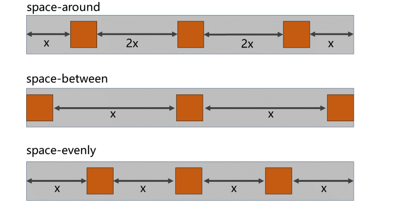
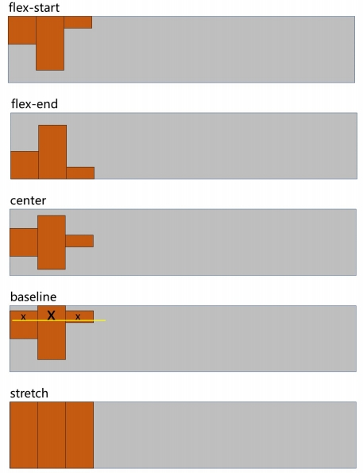
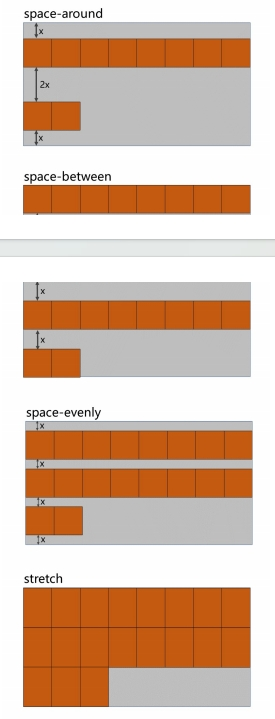

## CSS2

### 选择器

#### 伪类选择器

**一、动态伪类：** 

1. :link 超链接未被访问的状态。 

2. :visited 超链接访问过的状态。

3. :hover 鼠标悬停在元素上的状态。

4. :active 元素激活的状态。 

   什么是激活？—— 按下鼠标不松开。 注意点：遵循 LVHA 的顺序，即： link 、 visited 、 hover 、 active 。

5. :focus 获取焦点的元素。 表单类元素才能使用 :focus 伪类。

    当用户：点击元素、触摸元素、或通过键盘的 “ tab ” 键等方式，选择元素时，就是获 得焦点。

**二、结构伪类** 

常用的： 

1. :first-child 所有兄弟元素中的第一个。
2. :last-child 所有兄弟元素中的最后一个。
3. :nth-child(n) 所有兄弟元素中的第 n 个。
4. :first-of-type 所有同类型兄弟元素中的第一个。
5. :last-of-type 所有同类型兄弟元素中的最后一个。
6. :nth-of-type(n) 所有同类型兄弟元素中的 第n个 。 

关于 n 的值： 

1. 0 或 不写 ：什么都选不中 —— 几乎不用。 
2. n ：选中所有子元素 —— 几乎不用。
3. 1~正无穷的整数 ：选中对应序号的子元素。 
4. 2n 或 even ：选中序号为偶数的子元素。 
5. 2n+1 或 odd ：选中序号为奇数的子元素。 
6. -n+3 ：选中的是前 3 个。

**三、否定伪类**

:not(选择器) 排除满足括号中条件的元素。

**四、UI伪类**

1. :checked 被选中的复选框或单选按钮。 
2. :enable 可用的表单元素（没有 disabled 属性）。 
3. :disabled 不可用的表单元素（有 disabled 属性）。

####  伪元素选择器

- ::first-letter 选中元素中的第一个文字。 
- ::first-line 选中元素中的第一行文字。
- ::selection 选中被鼠标选中的内容。 
- ::placeholder 选中输入框的提示文字。 
- ::before 在元素最开始的位置，创建一个子元素（必须用 content 属性指定内容）。 
- ::after 在元素最后的位置，创建一个子元素（必须用 content 属性指定内容）。

### 颜色

~~~css
color: rgb(255,0,0);/* 不透明色 */
color: rgba(199, 123, 123, 0.5);/* 半透明色 */
color: rgba(199, 123, 123, 50%);/* 半透明色 */
color: #ffffff;/* 白色 */
~~~

### 字体

#### 字体大小

~~~css
font-size: 40px;
由于字体设计原因，文字最终呈现的大小，并不一定与 font-size 的值一致，可能大，也可能小。
~~~

#### 字体类型

~~~css
font-family: "微软雅黑";
font-family: "楷体";
font-family: "宋体"; 
font-family: "华文彩云";    
font-family: "翩翩体-简","华文彩云","华文琥珀","微软雅黑";
~~~

#### 字体风格

~~~css
font-style: italic;
1. normal ：正常（默认值）
2. italic ：斜体（使用字体自带的斜体效果）
3. oblique ：斜体（强制倾斜产生的斜体效果）
~~~

#### 字体粗细

~~~css
font-weight: bold; 
1. lighter ：细
2. normal ： 正常
3. bold ：粗
4. bolder ：很粗 （多数字体不支持）

font-weight: 600; 
1. 100~1000 且无单位，数值越大，字体越粗 （或一样粗，具体得看字体设计时的精确程度）。
2. 100~300 等同于 lighter ， 400~500 等同于 normal ， 600 及以上等同于
bold 。
~~~

### 文本属性

 #### 文本间距

~~~css
letter-spacing: 20px;/* 字母间距 */
word-spacing: 20px;/* 单词间距 */
~~~

#### 文本修饰

~~~css
text-decoration:overline dotted green;/* 上划的绿色虚线 */ 
text-decoration: underline wavy red;/* 下划的红色波浪线 */ 
text-decoration: line-through;/* 删除线 */ 
text-decoration: none;/* 没有各种线 */
~~~

####  文本缩进

~~~css
text-indent:40px;
~~~

####  文本对齐_水平

~~~~css
text-align: center; 
1. left ：左对齐（默认值）
2. right ：右对齐
3. center ：居中对齐
~~~~

#### 行高

```css
/* 第一种写法，值为像素 */
line-height: 40px;
/* 第二种写法，值为normal */
line-height: normal;
/* 第三种写法，值为数值 —— 用的比较多 */
line-height: 1.5;
/* 第四种写法，值为百分比 */
line-height: 150%;

1. normal ：由浏览器根据文字大小决定的一个默认值。
2. 像素( px )。
3. 数字：参考自身 font-size 的倍数（很常用）。
4. 百分比：参考自身 font-size 的百分比。

设置了 height ，那么高度就是 height 的值。
不设置 height 的时候，会根据 line-height 计算高度。
1. 对于多行文字：控制行与行之间的距离。
2. 对于单行文字：让 height = line-height ，可以实现文字垂直居中。
```

#### 文本对齐_垂直

```css
1. 顶部：无需任何属性，在垂直方向上，默认就是顶部对齐。
2. 居中：对于单行文字，让 height = line-height 即可。
	? 问题：多行文字垂直居中怎么办？ 后面我们用定位去做。
3. 底部：对于单行文字，目前一个临时的方式：
	让 line-height = ( height × 2 ) - font-size - x。
	备注： x 是根据字体族，动态决定的一个值。
	问题：垂直方向上的底部对齐，更好的解决办法是什么？—— 后面我们用定位去做
```

### vertical-align

~~~css
作用：用于指定同一行元素之间，或 表格单元格 内文字的 垂直对齐方式。
常用值：
1. baseline （默认值）：使元素的基线与父元素的基线对齐。
2. top ：使元素的顶部与其所在行的顶部对齐。
3. middle ：使元素的中部与父元素的基线加上父元素字母 x 的一半对齐。
4. bottom ：使元素的底部与其所在行的底部对齐。
特别注意：vertical-align 不能控制块元素
~~~

### 背景属性

~~~css
background-color: skyblue;
/* 设置背景图片 */
background-image: url(../images/悟空.jpg);
/* 设置背景图片的重复方式 单张 多张  */
background-repeat: no-repeat;
	repeat ：重复，铺满整个元素，默认值。
	repeat-x ：只在水平方向重复。
	repeat-y ：只在垂直方向重复。
	no-repeat ：不重复。

/* 控制背景图片的位置——第一种写法：用关键词 */
background-position: center;
	水平： left 、 center 、 right
	垂直: top 、 center 、 bottom
	如果只写一个值，另一个方向的值取 center
/* 控制背景图片的位置——第二种写法：用具体的像素值 */
background-position: 100px 200px;
	坐标原点:元素左上角
	两个值，分别是 x 坐标和 y 坐标。
	只写一个值，会被当做 x 坐标， y 坐标取 center
/* 复合属性 */
background: url(../images/悟空.jpg) no-repeat 100px 200px;
~~~

### 鼠标属性

~~~css
cursor: url("../images/arrow.png"),pointer;
cursor: move;

属性值：
	pointer ：小手
	move ：移动图标
	text ：文字选择器
	crosshair ：十字架
	wait ：等待
	help ：帮助

~~~


### 列表属性

| 属性名              | 属性               | 属性值                                                       |
| ------------------- | ------------------ | :----------------------------------------------------------- |
| `list-style-type`   | 设置列表符号       | 属性值<br/>     list-style-type 设置列表符号<br/>     常用值如下：<br/>none ：不显示前面的标识（很常用！）<br/>square ：实心方块<br/>disc ：圆形<br/>decimal ：数字<br/>lower-roman ：小写罗马字<br/>upper-roman ：大写罗马字<br/>lower-alpha ：小写字母<br/>upper-alpha ：大写字母 |
| list-style-position | 设置列表符号的位置 | inside ：在 li 的里面 outside ：在 li 的外边                 |
| list-style-image    | 自定义列表符号     | list-style-image 自定义列表符号 u                            |
| list-style          | 复合属性           | 没有数量、顺序的要求                                         |

### 边框属性

**表格也能用**

| 属性名       | 功能             | 属性值                                                       |
| ------------ | ---------------- | ------------------------------------------------------------ |
| border-width | 边框宽度 默认3px | CSS 中可用的长度值                                           |
| border-color | 边框颜色         | CSS 中可用的颜色值                                           |
| border-style | 边框风格         | none 默认值<br/>solid 实线<br/>dashed 虚线<br/>dotted 点线<br/>double 双实线 |
| border       | 边框复合属性     | 没有数量、顺序的要求                                         |

**各个方向上的边框：**

~~~css
border-left
border-left-style
border-left-width
border-left-color
border-right
border-right-style
border-right-width
border-right-color
border-top
border-top-style
border-top-width
border-top-color
border-bottom
border-bottom-style
border-bottom-width
border-bottom-color
~~~

### 表格属性

~~~css
border:2px green solid;
width:500px;
/* 表格列宽  
auto ：自动，列宽根据内容计算（默认值）。
fixed ：固定列宽，平均分。*/
table-layout: fixed;
/* 控制单元格间距（生效的前提是：不能合并边框） */
border-spacing: 10px;
/* 合并相邻的单元格的边框 
collapse ：合并
separate ：不合并*/
border-collapse: collapse;
/* 隐藏没有内容的单元格（生效的前提是：不能合并边框 单元格不能合并） 
show ：显示，默认
hide ：隐藏 
*/
empty-cells: hide;
/* 设置表格标题的位置 
top ：上面（默认值）
bottom ：在表格下面*/
caption-side: top;
~~~

### 元素显示模式

#### display

~~~css
none 元素会被隐藏。
block 元素将作为块级元素显示。
inline 元素将作为内联元素显示。
inline-block 元素将作为行内块元素显示。
~~~

#### 块元素

**特点：**

在页面中独占一行，不会与任何元素共用一行，是从上到下排列的。 2. 默认宽度：撑满父元素。 3. 默认高度：由内容撑开。 4. 可以通过 CSS 设置宽高。

~~~ html
1. 主体结构标签： <html> 、 <body>
2. 排版标签： <h1> ~ <h6> 、 <hr> 、 <p> 、 <pre> 、 <div>
3. 列表标签： <ul> 、 <ol> 、 <li> 、 <dl> 、 <dt> 、 <dd>
4. 表格相关标签： <table> 、 <tbody> 、 <thead> 、 <tfoot> 、 <tr> 、<caption>
5. <form> 与 <option>
~~~

#### 行内元素

**特点：**

1. 在页面中不独占一行，一行中不能容纳下的行内元素，会在下一行继续从左到右排列。 
2.  默认宽度：由内容撑开。
3.  默认高度：由内容撑开。 
4. 无法通过 CSS 设置宽高。

~~~html
1. 文本标签： <br> 、 <em> 、 <strong> 、 <sup> 、 <sub> 、 <del> 、 <ins>
2. <a> 与 <label>
~~~

#### 行内块元素

**特点：**

1. 在页面中不独占一行，一行中不能容纳下的行内元素，会在下一行继续从左到右排列。 
2. 默认宽度：由内容撑开。 
3. 默认高度：由内容撑开。 
4. 可以通过 CSS 设置宽高。

**注意：**元素早期只分为：行内元素、块级元素，区分条件也只有一条："是否独占一行"，如果按照这种 分类方式，行内块元素应该算作行内元素。

~~~css
1. 图片： 
2. 单元格： <td> 、 <th>
3. 表单控件： <input> 、 <textarea> 、 <select> 、 <button>
4. 框架标签： <iframe>
~~~

### 盒子模型

盒子的大小 = content + 左右 padding + 左右 border 。

#### 长度单位

~~~css
CSS2
1. em（相对于当前元素或其父元素的font-size的倍数）
width: 10em;
2. rem（相对于根元素的font-size的倍数）
width: 10rem;
3. %（相对其父元素的%）
width: 10%;
CSS3
1. rem 根元素字体大小的倍数，只与根元素字体大小有关。
2. vw 视口宽度的百分之多少 10vw 就是视口宽度的 10% 。
3. vh 视口高度的百分之多少 10vh 就是视口高度的 10% 。
4. vmax 视口宽高中大的那个的百分之多少。（了解即可）
5. vmin 视口宽高中小的那个的百分之多少。（了解即可）

~~~

#### 盒子内容区

**最大最小高宽**

~~~css
min-width: 600px;
max-width: 1000px;
min-height: 50px;
max-height: 400px;

注意：
max-width 、 min-width 一般不与 width 一起使用。
max-height 、 min-height 一般不与 height 一起使用。
~~~

#### 默认宽度

**总宽度** = 父的 content — 自身的左右 margin 。 

**内容区的宽度** = 父的content — 自身的左右 margin — 自身的左右 border — 自身的左右 padding 。

#### 内边距padding

~~~css
1. padding: 10px; 四个方向内边距都是 10px 。
2. padding: 10px 20px; 上下 10px ，左右 20px 。（上下、左右）
3. padding: 10px 20px 30px; 上 10px ，左右 20px ，下 30px 。（上、左右、下）
4. padding: 10px 20px 30px 40px; 上 10px ，右 20px ，下 30px ，左 40px 。（上、右、下、左）
~~~

注意点： 

1. padding 的值不能为负数。 
2. 行内元素 的 左右内边距是没问题的，上下内边距不能完美的设置。 
3. 块级元素、行内块元素，四个方向内边距都可以完美设置。

#### 外边距margin

~~~css
margin-left: 10px;
margin-right: 20px; 
margin-top: 30px; 
margin-bottom: 40px; 
margin		规律同 padding 
~~~

**注意事项：**

~~~css
1. 子元素的 margin ，是参考父元素的 content 计算的。（因为是父亲的 content 中承装着子元素）
2. 上 margin 、左 margin影响自己的位置；下 margin、右 margin影响后面兄弟元素的位置。
3. 块级元素、行内块元素，均可以完美地设置四个方向的 margin；但行内元素，左右margin 可以完美设置，上下 margin 设置无效。
4. margin 的值也可以是 auto，如果给一个块级元素设置左右 margin 都为 auto ，该块级元素会在父元素中水平居中。
5. margin 的值可以是负值。
~~~

#### margin塌陷问题

**什么是margin塌陷:**

- 第一个 子元素 的上 margin 会作用在父元素上，最后一个 子元素 的下 margin 会作用在父元素上。

**如何解决 margin塌陷？**

- **方案一：**给父元素设置不为 0 的 padding 。
- **方案二：**给父元素设置宽度不为 0 的 border 。 
- **方案三：**给父元素设置 css 样式 overflow:hidden

#### margin合并问题

**什么是 margin 合并** 

- 上面兄弟元素的下外边距和下面兄弟元素的上外边距会合并，取一个最大的值，而不是相加。 

**如何解决 margin 塌陷？** 

- 无需解决，布局的时候上下的兄弟元素，只给一个设置上下外边距就可以了。

#### 内容溢出
给内容增加滚动条

~~~css
overflow: auto;
overflow-x: visible;
overflow-y: hidden;
~~~

#### 隐藏元素

~~~css
/*长宽高不在*/
display: none;  
/*长宽高存在*/
visibility: hidden; 
~~~

#### 默认样式

元素一般都些默认的样式

优先级：**元素的默认样式** **>** **继承的样式**

#### 布局小技巧

1. 行内元素、行内块元素，可以被父元素当做文本处理。
2. 如何让子元素，在父亲中 **水平居中**
   -  若子元素为**块元素**，给父元素加上： margin:0 auto; 
   - 若子元素为**行内元素、行内块元素**，给父元素加上： text-align:center ;
3. 如何让子元素，在父亲中 **垂直居中**
   - 若子元素为**块元素**，给子元素加上：margin-top ，值为：(父元素 content －子元素盒子 总高) / 2。
   - 若子元素为**行内元素、行内块元素**：让父元素的 height = line-height ，每个子元素都加上： vertical-align:middle;  
   - 补充：若想绝对垂直居中，父元素 font-size 设置为 0 ;

#### 元素之间的空白

**产生原因：** 行内元素、行内块元素，彼此之间的换行会被浏览器解析为一个空白字符。 
**解决方案：** 

1. **方案一：** 去掉换行和空格（不推荐）。 
2. **方案二：** 给父元素设置 font-size:0 ，再给需要显示文字的元素，单独设置字体大小（推 荐）。

#### 行内块的幽灵空白

**产生原因：** 行内块元素与文本的基线对齐，而文本的基线与文本最底端之间是有一定距离的。 

**解决方案：**

~~~css
方案一： 给行行内块设置 vertical ，值不为 baseline 即可，设置为 middel 、 bottom 、top 均可。
方案二： 若父元素中只有一张图片，设置图片为 display:block 。
方案三： 给父元素设置 font-size: 0 。如果该行内块内部还有文本，则需单独设置 fontsize 。
~~~

### 浮动

#### 设置浮动

~~~css
float: left
left : 设置左浮动
right : 设置右浮动
none ：不浮动，默认值
~~~

#### 清除浮动

~~~css
clear: both
left ：清除前面左浮动的影响
right ：清除前面右浮动的影响
both ：清除前面左右浮动的影响
~~~


**浮动特点：**

1. 🤢脱离文档流。 
2. 😊不管浮动前是什么元素，浮动后：默认宽与高都是被内容撑开（尽可能小），而且可以设置宽高。
3. 😊不会独占一行，可以与其他元素共用一行。
4. 😊**不会 margin 合并，也不会 margin 塌陷，能够完美的设置四个方向的 margin 和 padding 。**
5. 😊**不会像行内块一样被当做文本处理（没有行内块的空白问题）。**

#### 元素浮动的影响

- 对**兄弟元素**的影响： 后面的兄弟元素，会占据浮动元素之前的位置，在浮动元素的下面；对前面的兄弟 无影响。 

- 对**父元素**的影响： 不能撑起父元素的高度，导致父元素高度塌陷；但父元素的宽度依然束缚浮动的元素。

#### 解决浮动影响（清除浮动）

1. 方案一： 给父元素指定高度。 

2. 方案二： 给父元素也设置浮动，带来其他影响。 

3. 方案三： 给父元素设置 overflow:hidden 。 

4. 方案四： 在所有浮动元素的最后面，添加一个块级元素，并给该块级元素设置 clear:both 。 

5. 方案五： 给浮动元素的父元素，设置伪元素，通过伪元素清除浮动，原理与方案四相同。===> 推 荐使用

   ~~~css
   .parent::after {
   	content: "";
   	display: block;
   	clear:both;
   }
   ~~~

   **注意：**

   **布局中的一个原则：设置浮动的时候，兄弟元素要么全都浮动，要么全都不浮动。**

### 定位

#### 相对定位

**如何定位**

~~~css
position: relative;
top: 10px;
left: 10px;
可以使用 left 、 right 、 top 、 bottom 四个属性调整位置。
~~~

**参考点：**相对自己原来的位置

**特点：**

1. 不会脱离文档流，元素位置的变化，只是视觉效果上的变化，不会对其他元素产生任何影响。
2. 定位元素的显示层级比普通元素高。
   - 定位的元素会盖在普通元素之上。 
   - 都发生定位的两个元素，后写的元素会盖在先写的元素之上。
3. left 不能和 right 一起设置， top 和 bottom 不能一起设置。
4. 相对定位的元素，也能继续浮动，但**不推荐**这样做。
5. 相对定位的元素，也能通过 margin 调整位置，但**不推荐**这样做。

**注意：绝大多数情况下，相对定位，会与绝对定位配合使用。**

~~~css
.father{ 
     position: relative;
}
~~~


#### 绝对定位

**如何定位**

~~~css
position: absolute;
top: 220px;
left: 20px;
可以使用 left 、 right 、 top 、 bottom 四个属性调整位置。
~~~

**参考点： ** 参考它的包含块。 

什么是包含块？

1. 对于没有脱离文档流的元素：包含块就是父元素； 
2. 对于脱离文档流的元素：包含块是第一个拥有定位属性的祖先元素（如果所有祖先都 没定位，那包含块就是整个页面）。

**特点：**

1. 脱离文档流，会对后面的兄弟元素、父元素有影响。 

2. left 不能和 right一起设置， top 和 bottom 不能一起设置。 

3. **绝对定位、浮动不能同时设置**，如果同时设置，浮动失效，以定位为主。 

4. 绝对定位的元素，也能通过 margin 调整位置，但**不推荐**这样做。 

5. 无论是什么元素（行内、行内块、块级）设置为绝对定位之后，都变成了定位元素。 

   **何为定位元素？** —— 默认宽、高都被内容所撑开，且能自由设置宽高。

#### 固定定位

**如何定位**

~~~css
position: fixed;
top: 220px;
left: 20px;
可以使用 left、 right、 top、 bottom 四个属性调整位置。
~~~

**参考点：**参考它的视口 

​	**什么是视口？**—— 对于 PC 浏览器来说，视口就是我们看网页的那扇“窗户”。

**特点：**

1. 脱离文档流，会对后面的兄弟元素、父元素有影响。 

2. left 不能和 right 一起设置， top 和 bottom 不能一起设置。

3. **固定定位和浮动不能同时设置**，如果同时设置，浮动失效，以固定定位为主。 

4. 固定定位的元素，也能通过 margin 调整位置，但**不推荐**这样做。 

5. 无论是什么元素（行内、行内块、块级）设置为固定定位之后，都变成了定位元素。

   **何为定位元素？** —— 默认宽、高都被内容所撑开，且能自由设置宽高。

#### 粘性定位

**如何定位**

~~~css
position: sticky;
top: 220px;
left: 20px;
可以使用 left、 right、 top、 bottom 四个属性调整位置。
~~~

**参考点：**离它最近的一个拥有**“滚动机制”**的祖先元素，即便这个祖先不是最近的真实可滚动祖先。

**特点：**

- 不会脱离文档流，它是一种专门用于窗口滚动时的新的定位方式。 
- 最常用的值是 top 值。 
- 粘性定位和**浮动**可以同时设置，但**不推荐**这样做。 
- 粘性定位的元素，也能通过**margin**调整位置，但**不推荐**这样做。

 粘性定位和相对定位的特点基本一致，不同的是：粘性定位可以在元素到达某个位置时将其固定。

#### 定位层级 

1. 定位元素的显示层级比普通元素高，无论什么定位，显示层级都是一样的。 
2. 如果位置发生重叠，默认情况是：**后面的元素，会显示在前面元素之上**。 
3. 可以通过 css 属性 z-index 调整元素的显示层级。 
4. z-index 的属性值**是数字，没有单位**，值越大显示层级越高。
5. 只有**定位的元素**设置**z-index** 才**有效**。 
6. 如果 z-index 值大的元素，依然没有覆盖掉 z-index 值小的元素，那么请检查其包含块的层级。

#### 定位的特殊应用

- 发生相对定位后，元素依然是之前的显示模式。 
- 以下所说的特殊应用，只针对 **绝对定位 和 固定定位** 的元素，不包括相对定位的元素。

##### **让定位元素的宽充满包含块** 

1. 块宽想与包含块一致，可以给定位元素同时设置 left 和 right 为 0 。 
1. 高度想与包含块一致， top 和 bottom 设置为 0。

##### **让定位元素在包含块中居中**

- 方案一

  ~~~css
  left:0;
  right:0;
  top:0;
  bottom:0;
  margin:auto;
  ~~~

- 方案二

  ~~~css
  left: 50%;
  top: 50%;
  margin-left: 负的宽度一半;
  margin-top: 负的高度一半;
  ~~~

  

## CSS3

### 新增盒模型

#### box-sizing 怪异盒模型

| box-sizing: content-box    | width 和 height 设置的是盒子内容区的大小。（默认值）   |
| -------------------------- | ------------------------------------------------------ |
| **box-sizing: border-box** | **width 和 height 设置的是盒子总大小。（怪异盒模型）** |

```css
border: 5px solid black;
width: 200px;
height: 200px;
```

#### resize 调整盒子大小

```css
resize: none;
overflow: scroll;
none 不允许用户调整元素大小。 (默认)
both 用户可以调节元素的宽度和高度。
horizontal 用户可以调节元素的宽度 。
vertical 用户可以调节元素的高度。
```

#### box-shadow 盒子阴影

```css
写三个值，含义：水平位置 垂直位置 模糊程度
box-shadow: 10px 10px 20px; 
写四个值，含义：水平位置 垂直位置 模糊程度 阴影颜色
box-shadow: 10px 10px 20px blue;
写五个值，含义：水平位置 垂直位置 模糊程度 外延值 阴影颜色
box-shadow: -10px -10px 20px 10px blue;
写六个值，含义：水平位置 垂直位置 模糊程度 外延值 阴影颜色 内阴影
box-shadow: 10px 10px 20px 10px blue inset;

box-shadow: h-shadow v-shadow blur spread color inset; 
h-shadow 水平阴影的位置，必须填写，可以为负值
v-shadow 垂直阴影的位置，必须填写，可以为负值
blur 可选，模糊距离
spread 可选，阴影的外延值
color 可选，阴影的颜色
inset 可选，将外部阴影改为内部阴影 
```

#### opacity 透明

- opacity 属性能为整个元素添加透明效果， 值是 0 到 1 之间的小数， 0 是完全透明， 1 表示完 全不透明。 

- opacity 与 rgba 的区别？
  - opacity 是一个属性，设置的是整个元素（包括元素里的内容）的不透明度。
  - rgba 是颜色的设置方式，用于设置颜色，它的透明度，仅仅是调整颜色的透明度。

```css
opacity: 0.1;
```

### 背景图

#### 背景图的原点**background-origin**

```css
background-origin: border-box;
1. padding-box：从 padding 区域开始显示背景图像。—— 默认值
2. border-box： 从 border 区域开始显示背景图像。
3. content-box： 从 content 区域开始显示背景图像。
```

#### 背景图的向外裁剪**background-clip**

```css
1. border-box ： 从 border 区域开始向外裁剪背景。 —— 默认值
2. padding-box ： 从 padding 区域开始向外裁剪背景。
3. content-box ： 从 content 区域开始向外裁剪背景。
4. text ：背景图只呈现在文字上。
```

**注意：**<span style="color: skyblue;">若值为text</span> ，那么 backgroun-clip 要加上 -webkit- 前缀。

#### 背景图的尺寸background-size

```css
1. 用长度值指定背景图片大小，不允许负值。
background-size: 300px 200px;

2. 用百分比指定背景图片大小，不允许负值。
background-size: 100% 100%;

3. auto：背景图片的真实大小。 —— 默认值

4. contain ： 将背景图片等比缩放，使背景图片的宽或高，与容器的宽或高相等，再将完整背景图片包含在容器内，但要注意：可能会造成容器里部分区域没有背景图片。
background-size: contain;

5. cover ：将背景图片等比缩放，直到完全覆盖容器，图片会尽可能全的显示在元素上，但要注意：背景图片有可能显示不完整。—— 相对比较好的选择
background-size: cover;
```

#### **backgorund** **复合属性**

~~~css
background: color url repeat position / size origin clip
注意:
origin 和 clip 的值如果一样，如果只写一个值，则 origin 和 clip 都设置；如果设置了两个值，前面的是 origin ，后面的是clip； size 的值必须写在 position 值的后面，并且用 / 分开。
~~~

#### **多背景图**

~~~css
    background: url('../images/bg-lt.png') no-repeat left top,
                        url('../images/bg-rt.png') no-repeat right top,
                        url('../images/bg-lb.png') no-repeat left bottom,
                        url('../images/bg-rb.png') no-repeat right bottom;
~~~


### 边框属性

#### 边框圆角

 **同时设置四个角的圆角**

```css
border-radius:10px;
```

**分开设置每个角的圆角（几乎不用）:**笔记或百度

#### 边框外轮廓（了解） ：

```css
outline-width ：外轮廓的宽度。
outline-color ：外轮廓的颜色。
outline-style ：外轮廓的风格。
	none ： 无轮廓
	dotted ： 点状轮廓
	dashed ： 虚线轮廓
	solid ： 实线轮廓
	double ： 双线轮廓
outline-offset 设置外轮廓与边框的距离，正负值都可以设置
```

**注意： outline-offset 不是 outline 的子属性，是一个独立的属性。**

**outline 复合属性**

~~~css
outline:50px solid blue;
~~~

### 文本属性

#

### 渐变

#

### web字体

#

### 2D变换

#

### 3D变换

#

### 过渡

#### 属性transition-property

**常用值：**

	1. none ：不过渡任何属性。
	2. all ：过渡所有能过渡的属性。
	3. 具体某个属性名 ，例如： width 、 heigth ，若有多个以逗号分隔。

**注意：**

- 不是所有的属性都能过渡，值为数字，或者值能转为数字的属性，都支持过渡，否则不支持过渡。

- 常见的支持过渡的属性有：颜色、长度值、百分比、 z-index 、 opacity 、 2D 变换属性、 3D 变换属性、阴影。

####  过程时间transition-duration

- 0：没有任何过渡时间 —— 默认值。
- s 或 ms：秒或毫秒。

#### 停顿transition-delay

- 作用：指定开始过渡的延迟时间，单位： s 或 ms

```css
/* 设置哪个属性需要过渡效果 */
transition-property: width,height,background-color; 
transition-duration: 1s,1s,1s;  

/* 让所有能过渡的属性，都过渡 */
transition-property: all; 
/* 设置一个时间，所有人都用 */
transition-duration: 1s;

/* 分别设置时间 */
transition-delay: 1s;
```

#### 过渡类型 transition-timing-function

**作用：**设置过渡的类型

**常用值：**

~~~css
1. ease ： 平滑过渡 —— 默认值
2. linear ： 线性过渡
3. ease-in ： 慢 → 快
4. ease-out ： 快 → 慢
5. ease-in-out ： 慢 → 快 → 慢
6. step-start ： 等同于 steps(1, start)
7. step-end ： 等同于 steps(1, end)
8. steps( integer,?) ： 接受两个参数的步进函数。第一个参数必须为正整数，指定函数的
步数。第二个参数取值可以是 start 或 end ，指定每一步的值发生变化的时间点。第二个
参数默认值为 end 。
9. cubic-bezie ( number, number, number, number)： 特定的贝塞尔曲线类型。
10. 在线制作曲线： https://cubic-bezier.com
~~~


#### **transition** **复合属性**

如果设置了一个时间，表示 duration ；如果设置了两个时间，第一是 duration ，第二个是

delay ；其他值没有顺序要求。

```css
transition:1s 1s linear all;
```

### 动画

#

### 多列布局

~~~css
column-count ：指定列数，值是数字。
column-width ：指定列宽，值是长度。
columns ：同时指定列宽和列数，复合属性；值没有数量和顺序要求（不推荐使用）
column-gap ：设置列边距，值是长度。
column-rule-style ：设置列与列之间边框的风格，值与 border-style 一致。
column-rule-width ：设置列与列之间边框的宽度，值是长度。
column-rule-color ：设置列与列之间边框的颜色。
coumn-rule ：设置列边框，复合属性。
column-span 指定是否跨列；值: none 、 all 。
~~~

### 伸缩盒子模型

#### 容器和项目

**伸缩容器**： 开启了 flex 的元素，就是：伸缩容器。

1. 给元素设置： display:flex 或 display:inline-flex ，该元素就变为了伸缩容器。

2. display:inline-flex 很少使用，因为可以给多个伸缩容器的父容器，也设置为伸缩容器。

3. 一个元素可以同时是：伸缩容器、伸缩项目。

**伸缩项目**：伸缩容器所有**子元素**自动成为了：伸缩项目。

1. 仅伸缩容器的**子元素**成为了伸缩项目，孙子元素、重孙子元素等后代，不是伸缩项目。

2. 无论原来是哪种元素（块、行内块、行内），一旦成为了伸缩项目，**全都会“块状化”。**

#### 主轴与侧轴

**主轴：** 伸缩项目沿着主轴排列，主轴默认是水平的，默认方向是：**从左到右**（左边是起点，右边是终点）。

**侧轴：** 与主轴垂直的就是侧轴，侧轴默认是垂直的，默认方向是：**从上到下**（上边是起点，下边是终点）。

####  主轴方向

**属性名：** flex-direction 

~~~css
1. row ：主轴方向水平从左到右 —— 默认值
2. row-reverse ：主轴方向水平从右到左。
3. column ：主轴方向垂直从上到下。
4. column-reverse ：主轴方向垂直从下到上。
~~~

**注意：**改变了主轴的方向，侧轴方向也随之改变。

#### 主轴换行方式

**属性名：**flex-wrap

~~~css
nowrap :默认值，不换行。
wrap :自动换行，伸缩容器不够自动换行。
wrap-reverse :反向换行。
~~~

#### flex-flow 

flex-flow 是一个复合属性，复合了 flex-direction 和 flex-wrap 两个属性。 值没有顺序要求。

~~~css
flex-flow: row wrap;
~~~

#### 主轴对齐方式

**属性名：justify-content**

**常用值如下：**

~~~css
1. flex-start ：主轴起点对齐。—— 默认值  
2. flex-end ：主轴终点对齐。
3. center ：居中对齐。
4. space-between ：均匀分布，两端对齐（最常用）。
5. space-around ：均匀分布，两端距离是中间距离的一半。
6. space-evenly ：均匀分布，两端距离与中间距离一致。
~~~



#### 侧轴对齐方式

##### **一行的情况**

**所需属性： align-items**

常用值如下：

~~~css
1. flex-start ：侧轴的起点对齐。
2. flex-end ：侧轴的终点对齐。
3. center ：侧轴的中点对齐。
4. baseline : 伸缩项目的第一行文字的基线对齐。
5. stretch ：如果伸缩项目未设置高度，将占满整个容器的高度。—— （默认值）
~~~



##### 多行的情况

**所需属性： align-content**

常用值如下：

~~~css
1. flex-start ：与侧轴的起点对齐。
2. flex-end ：与侧轴的终点对齐。
3. center ：与侧轴的中点对齐。
4. space-between ：与侧轴两端对齐，中间平均分布。
5. space-around ：伸缩项目间的距离相等，比距边缘大一倍。
6. space-evenly : 在侧轴上完全平分。
7. stretch ：占满整个侧轴。—— 默认值
~~~



#### **flex** 实现水平垂直居中

方法一：父容器开启 flex 布局，随后使用 justify-content 和 align-items 实现水平垂直居中

~~~css
.outer {
	width: 400px;
	height: 400px;
	background-color: #888;
	display: flex;
	justify-content: center;
	align-items: center;
}
.inner {
	width: 100px;
	height: 100px;
	background-color: orange;
}
~~~

方法二：父容器开启 flex 布局，随后子元素 margin: auto

~~~css
.outer {
	width: 400px;
	height: 400px;
	background-color: #888;
	display: flex;
}
.inner {
	width: 100px;
	height: 100px;
	background-color: orange;
	margin: auto;
}
~~~

#### **伸缩性**

##### flex-basis

**概念：**flex-basis 设置的是主轴方向的基准长度，会让宽度或高度失效。

~~~css
flex-basis: 300px;
~~~

**备注：**

- 若主轴是横向的宽失效，若主轴是纵向的高失效

**作用：**浏览器根据这个属性设置的值，计算主轴上是否有多余空间，默认值auto，即：伸缩项目 的宽或高。

##### flex-grow（伸）

**概念：**flex-grow定义伸缩项目的放大比例，默认为 0 ，即：纵使主轴存在剩余空间，也不拉伸 （放大）。
**规则：**

1. 若所有伸缩项目的 flex-grow 值都为 1，则：它们将等分剩余空间（如果有空间的话）。
2. 若三个伸缩项目的 flex-grow 值分别为：1、2、3，则：分别瓜分到：1/6、2/6、3/6的空间。

##### flex-shrink（缩）

- **概念：** flex-shrink 定义了项目的压缩比例，默认为 1 ，即：如果空间不足，该项目将会缩小。

- 收缩项目的计算，略微复杂一点，我们拿一个场景举例： 

  例如：

  三个收缩项目，宽度分别为：200px、 300px 、 200px ，它们的 flex-shrink 值分别 为： 1 、 2 、 3 

  若想刚好容纳下三个项目，需要总宽度为 700px ，但目前容器只有 400px ，还差 300px 所以每个人都要收缩一下才可以放下，具体收缩的值，这样计算： 

  1. 计算分母： (200×1) + (300×2) + (200×3) = 1400 
  2. 计算比例： 
     - 项目一： (200×1) / 1400 = 比例值1 
     - 项目二： (300×2) / 1400 = 比例值2 
     - 项目三： (200×3) / 1400 = 比例值3
  3. 算最终收缩大小： 
     - 项目一需要收缩： 比例值1 × 300 
     - 项目二需要收缩： 比例值2 × 300 
     - 项目三需要收缩： 比例值3 × 300

##### flex复合属性 

flex 是复合属性，复合了： flex-grow 、 flex-shrink 、 flex-basis 三个属性，默认值为 0 1 auto 。

- 如果写 flex:1 1 auto ，则可简写为： flex:auto 
- 如果写 flex:1 1 0 ，则可简写为： flex:1 
- 如果写 flex:0 0 auto ，则可简写为： flex:none 
- 如果写 flex:0 1 auto ，则可简写为： flex:0 auto —— 即 flex 初始值。

##### 项目排序 

- order 属性定义项目的排列顺序。
- 数值越小，排列越靠前，默认为 0 。

##### 单独对齐 

- 通过 align-self 属性，可以单独调整某个伸缩项目的对齐方式 
- 默认值为 auto ，表示继承父元素的 align-items 属性。
